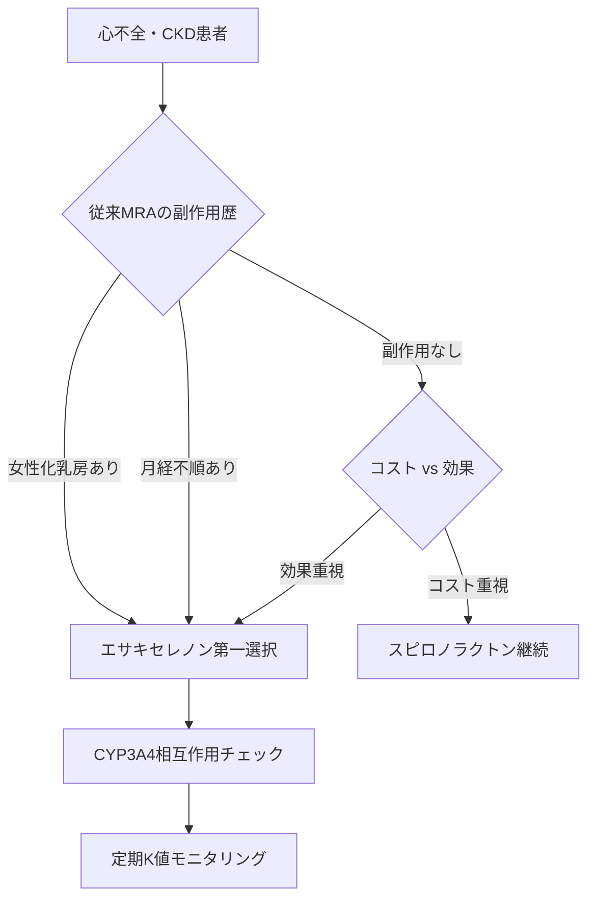
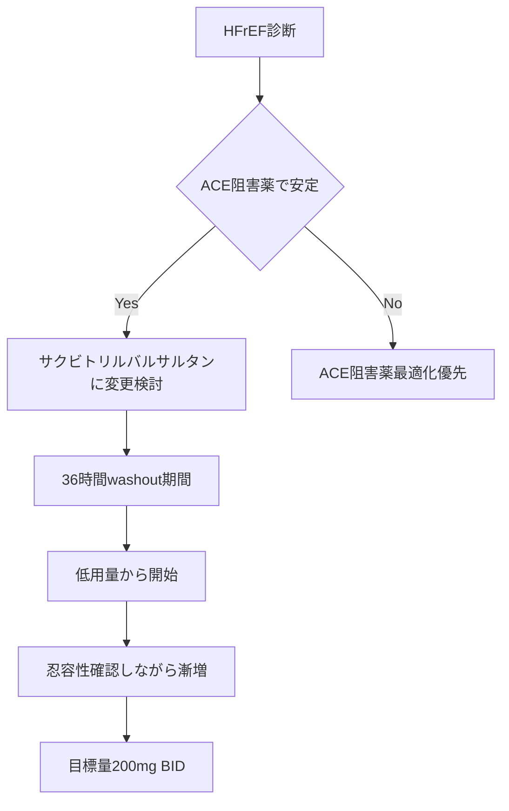

# 循環器系薬剤統合ガイド：処方設計の交響曲

## 🎼 序章：循環器系薬剤のオーケストラ

循環器系薬剤の処方設計は、オーケストラの指揮に似ている。各薬剤は異なる音色を持つ楽器であり、適切に組み合わせることで美しいハーモニー（治療効果）を生み出す。しかし、誤った組み合わせは不協和音（有害事象）を招く。

### 楽器（薬剤）の特性
- **ARB（弦楽器）**：穏やかで安定した音色、誰とでも調和しやすい
- **ACE阻害薬（管楽器）**：力強い音色だが、時に咳という雑音を伴う
- **β遮断薬（打楽器）**：リズムを整える、しかし使い方を誤ると演奏が止まる
- **利尿薬（金管楽器）**：華やかな効果だが、音量調整（用量）が難しい

## 🗺️ 循環器系薬剤の関係性マップ


### 相互作用の音階
- **協和音（相乗効果）** 🎵
  - ARB/ACE + 利尿薬 = 降圧効果増強
  - ARB/ACE + β遮断薬 = 心保護作用増強
  - β遮断薬 + 利尿薬 = 心不全改善
  
- **不協和音（注意すべき相互作用）** 🎼
  - ARB/ACE + K保持性利尿薬 = 高K血症
  - ARB + ACE = 原則併用禁忌（高K、腎機能悪化）
  - β遮断薬 + 非DHP系Ca拮抗薬 = 徐脈・心抑制

## 🎭 処方設計の思考プロセス：5幕構成

### 第1幕：患者という楽譜を読む

```
患者プロファイル解析
├── 年齢・性別
├── 血圧値・心拍数
├── 合併症
│   ├── 糖尿病 → ACE/ARB優先
│   ├── 心不全 → ACE/ARB + β遮断薬必須
│   ├── CKD → ACE/ARB（用量注意）
│   └── 喘息 → β遮断薬禁忌
└── 検査値
    ├── K値 → 高値ならK保持性利尿薬避ける
    ├── eGFR → 用量調整の指標
    └── 心エコー → EF低下なら心不全治療
```

### 第2幕：第一楽器（基礎薬）の選択


### 第3幕：第二楽器（併用薬）の追加

**併用の黄金律**
1. **ARB/ACE + 利尿薬**：最も基本的な2剤併用
2. **ARB/ACE + Ca拮抗薬**：腎機能低下例で有用
3. **ARB/ACE + β遮断薬**：心疾患合併例で必須

**なぜこの順番なのか？**
- 利尿薬：即効性があり、効果を実感しやすい
- Ca拮抗薬：副作用少なく、追加しやすい
- β遮断薬：心保護作用強いが、導入に注意必要

### 第4幕：三重奏への展開

```
典型的な3剤併用パターン

【標準型】
ARB/ACE + 利尿薬 + Ca拮抗薬
→ 最も安全で効果的

【心不全型】
ACE + β遮断薬 + 利尿薬
→ 予後改善のゴールデントリオ

【難治型】
ARB + Ca拮抗薬 + 利尿薬
→ 抵抗性高血圧への対応

【腎保護型】
ARB/ACE + 利尿薬 + MRA（少量）
→ 蛋白尿減少・腎保護
```

### 第5幕：四重奏以上の高度な編成


## ⚠️ 演奏上の注意：相互作用と対策

### 🎹 カリウムの調律（K値管理）

```
K上昇リスクの重ね合わせ
━━━━━━━━━━━━━━━━━━━━━
低リスク  ：ARB/ACE単独
中リスク  ：ARB/ACE + 普通の利尿薬
高リスク  ：ARB/ACE + K保持性利尿薬
超高リスク：ARB/ACE + K保持性 + NSAIDs
━━━━━━━━━━━━━━━━━━━━━

対策：
1. 開始2週間後にK値確認
2. K>5.5なら減量・中止検討
3. 定期的モニタリング（3-6ヶ月毎）
```

### 🎺 腎機能のテンポ（用量調整）

| eGFR (mL/min/1.73m²) | ACE/ARB | β遮断薬 | 利尿薬 |
|---------------------|---------|---------|---------|
| ≥60 | 通常量 | 通常量 | 通常量 |
| 30-59 | 50-75% | 通常量 | 効果↓ |
| 15-29 | 25-50% | 通常量 | ループ利尿薬 |
| <15 | 原則中止 | 慎重投与 | ループ利尿薬 |

### 🎻 併用禁忌の不協和音

```
絶対的禁忌
├── ACE + ARB（特殊な場合除く）
├── β遮断薬 + ベラパミル（高度徐脈）
└── K保持性利尿薬 + K製剤（致死的高K）

相対的禁忌（注意深く使用）
├── ACE/ARB + NSAIDs（腎機能悪化）
├── β遮断薬 + ジルチアゼム（徐脈）
└── 利尿薬 + リチウム（Li中毒）
```

## 📋 典型的処方パターン：5つの協奏曲

### 🎵 第1番：若年高血圧（合併症なし）
```
【患者】35歳男性、BP 160/100、合併症なし

【処方設計思考】
若年で臓器障害なし → 単剤から開始
将来の心血管イベント予防 → ACE/ARB選択

【処方】
1. オルメサルタン 20mg 1錠 分1 朝食後

【3ヶ月後：効果不十分（BP 145/92）】
2. アムロジピン 5mg 追加

【ポイント】
若年者は交感神経活性高い → Ca拮抗薬追加が有効
利尿薬は代謝への影響考慮し第3選択
```

### 🎵 第2番：糖尿病合併高血圧
```
【患者】62歳女性、BP 156/94、HbA1c 7.8%、尿蛋白(+)

【処方設計思考】
糖尿病+蛋白尿 → ACE第一選択（腎保護）
血糖への影響最小化 → β遮断薬・利尿薬慎重

【処方】
1. エナラプリル 5mg 1錠 分1 朝食後

【2週後：空咳出現】
1. カンデサルタン 8mg 1錠 分1 朝食後（変更）

【2ヶ月後：効果不十分】
2. アムロジピン 5mg 追加

【ポイント】
ACE→ARB変更は日常的
インスリン分泌/感受性への影響を考慮
```

### 🎵 第3番：心不全合併（HFrEF）
```
【患者】72歳男性、BP 138/88、EF 35%、NYHA II度

【処方設計思考】
心不全 → ACE+β遮断薬は必須
体液貯留 → 利尿薬併用
忍容性見ながら漸増

【処方】
1. エナラプリル 2.5mg 1錠 分2（少量開始）
2. フロセミド 20mg 1錠 分1 朝食後

【2週後：忍容性良好】
1. エナラプリル 5mg に増量
3. カルベジロール 1.25mg 分2 追加（超少量）

【その後の調整】
両剤を忍容性見ながら目標量まで漸増
K値によってはMRA追加考慮

【ポイント】
"Start low, go slow"が鉄則
ACE/β遮断薬は予後改善効果あり
```

### 🎵 第4番：CKD合併
```
【患者】68歳男性、BP 162/96、eGFR 38、尿蛋白 2+

【処方設計思考】
CKD+蛋白尿 → ARB/ACE必須
腎機能低下 → 用量調整必要
体液管理 → ループ利尿薬

【処方】
1. テルミサルタン 20mg（半量）1錠 分1
2. フロセミド 20mg 1錠 分1 朝食後

【1ヶ月後：K 5.2、BP 148/88】
3. アムロジピン 5mg 追加
（K上昇のため利尿薬増量は避ける）

【ポイント】
サイアザイドは無効、ループ利尿薬使用
K値と腎機能の厳重モニタリング
降圧目標は130/80未満だが個別化
```

### 🎵 第5番：高齢者
```
【患者】85歳女性、BP 168/86、認知機能軽度低下

【処方設計思考】
高齢者 → 起立性低血圧注意
認知機能 → 服薬シンプルに
臓器予備能低下 → 少量から

【処方】
1. アムロジピン 2.5mg 1錠 分1（Ca拮抗薬は安全）

【1ヶ月後：BP 152/82】
2. 少量ARB追加（オルメサルタン 10mg）

【ポイント】
降圧目標は140/90と緩め
1日1回製剤で服薬管理簡便化
利尿薬は脱水・電解質異常リスク
```

## 🎯 処方変更の極意：失敗から学ぶ

### 症例：失敗からの学び
```
【初回処方】58歳男性、BP 172/102
エナラプリル 10mg + ヒドロクロロチアジド 12.5mg

【2週後】
BP 128/78と良好も、K 5.8、Cr上昇

【何が問題だったか？】
- 2剤同時開始で原因薬剤不明
- 腎機能評価不十分
- K値の予測不足

【改善処方】
1. 一旦両剤中止
2. アムロジピン 5mg 単剤で再開
3. 腎機能改善後、少量ARB追加
```

### 処方変更の鉄則
1. **一度に一つ**：変更は1剤ずつ
2. **効果判定期間**：2-4週間は待つ
3. **中止も治療**：副作用なら躊躇なく中止
4. **記録が命**：変更理由を明確に

## 📊 併用療法の効果：エビデンスの裏付け

### 降圧効果の相乗性
```
単剤での降圧効果
━━━━━━━━━━━━━━━━━
ARB/ACE    ：8-10 mmHg
Ca拮抗薬   ：10-12 mmHg
利尿薬     ：8-10 mmHg
β遮断薬   ：6-8 mmHg
━━━━━━━━━━━━━━━━━

2剤併用での効果
━━━━━━━━━━━━━━━━━
ARB + 利尿薬    ：18-22 mmHg（相乗効果）
ARB + Ca拮抗薬  ：16-20 mmHg
ACE + β遮断薬  ：14-16 mmHg
━━━━━━━━━━━━━━━━━
```

### 臓器保護効果の重ね合わせ
- **心保護**：ACE/ARB + β遮断薬 > 単剤
- **腎保護**：ACE/ARB + 適切な降圧 > 降圧のみ
- **脳保護**：ARB + Ca拮抗薬 > 各単剤

## 🔄 統合的処方設計フローチャート


## 💡 深い洞察：なぜ併用療法が必要なのか

### 生体の叡智への挑戦
高血圧は、体が必要と判断して血圧を上げている状態。単一の機序をブロックしても、体は別の経路で血圧を維持しようとする。これが単剤療法の限界。

### オーケストラの必然性
- **ARB/ACE**：レニン系を抑える（弦楽器）
- **利尿薬**：体液量を減らす（金管楽器）
- **Ca拮抗薬**：血管を広げる（木管楽器）
- **β遮断薬**：心臓の働きを抑える（打楽器）

異なる音色（機序）を組み合わせることで、体の代償機構を多方面から抑制し、より自然で持続的な降圧が得られる。

### 個別化医療の真髄
患者一人一人が異なる楽譜（病態）を持っている。優れた指揮者（医師）は、その楽譜を読み解き、最適な楽器（薬剤）の組み合わせを選び、美しい音楽（治療効果）を奏でる。

## 🎼 第5.5章：新時代楽器の登場

### 🌟 21世紀オーケストラの革新

従来のオーケストラに、革新的な楽器が加わった。これらの「新時代楽器」は、従来楽器の限界を突破し、これまで不可能だった音色と効果を実現する。

### 🥁 エサキセレノン：改良版ティンパニ

**従来ティンパニ（スピロノラクトン）の課題克服**

```
🔴 従来ティンパニの問題点
├── 音質の不純さ（女性化乳房・月経不順）
├── 演奏者への負担（性ホルモン受容体誤作用）
└── 継続困難（副作用による演奏中断）

✨ 改良版ティンパニ（エサキセレノン）の革新
├── 純粋な打撃音（MRA選択的作用）
├── 雑音除去技術（性ホルモン関連副作用なし）
└── 安定したパフォーマンス（CYP3A4代謝）
```

**音楽理論での表現**
- **音色**：深く、純粋で、雑音のない低音
- **役割**：心不全・CKD患者での確実な体液調節
- **特殊技法**：従来不可能だった長期連続演奏

### ⚡ サクビトリルバルサルタン：ハイブリッド楽器（ARNi）

**楽器工学の革命**

```
🎵 デュアル機能システム
├── ARB機能（従来の弦楽器技術）
└── NEP阻害機能（新開発の増幅技術）
    └── BNP/ANP系活性化による新音域

🎼 演奏効果
├── 20%死亡率減少（PARADIGM-HF試験）
├── 心不全入院34%減少
└── QOL著明改善
```

**オーケストラでの位置づけ**
- **楽器種別**：エレクトロニック・ハイブリッド楽器
- **音域**：従来ARBを超越した新次元
- **演奏法**：心不全における革命的アプローチ

### 🎭 Before/After：治療音楽の変革

#### 従来オーケストラ編成（2010年代）

```
🎼 クラシック編成
├── 第1バイオリン：ACE阻害薬（エナラプリル）
├── 打楽器：従来ティンパニ（スピロノラクトン）
└── 金管楽器：利尿薬（フロセミド）

🔊 演奏上の制約
├── 女性化乳房による演奏者交代頻発
├── 限定的な心不全改善効果
└── 副作用による演奏中断リスク
```

#### 新時代オーケストラ編成（2020年代）

```
🎼 革新編成
├── ハイブリッド楽器：サクビトリルバルサルタン
├── 改良版ティンパニ：エサキセレノン
└── 金管楽器：利尿薬（変更なし）

🔊 革命的演奏効果
├── 副作用による中断ゼロ
├── 患者アウトカム劇的向上
└── 演奏者・聴衆双方の満足度最大化
```

### 🎯 新時代オーケストラの処方設計

#### エサキセレノン適応判断



#### サクビトリルバルサルタン導入フロー



### 🎼 新時代オーケストラの協奏技法

#### 三重奏：新時代心不全治療

**エサキセレノン + サクビトリルバルサルタン + β遮断薬**

```
🎵 第1楽章：導入期（慎重なチューニング）
├── サクビトリルバルサルタン低用量開始
├── エサキセレノン安全性確認
└── β遮断薬現状維持

🎵 第2楽章：調整期（ハーモニー構築）
├── 各薬剤の相互作用確認
├── 電解質バランス監視
└── 血圧・心拍数調整

🎵 第3楽章：完成期（最適化達成）
├── 目標用量達成
├── 副作用なし確認
└── 患者QOL最大化
```

### 🔬 新楽器の薬理学的革新

#### エサキセレノンの選択性進化

```
スピロノラクトン（1960年代）
└── 受容体選択性：低い
    ├── MR：+++
    ├── AR：++（女性化乳房）
    └── PR：+（月経不順）

エサキセレノン（2020年代）
└── 受容体選択性：極めて高い
    ├── MR：+++
    ├── AR：±（ほぼ作用なし）
    └── PR：±（ほぼ作用なし）
```

#### サクビトリルバルサルタンのデュアル作用

```
従来ARB
└── AT1受容体遮断のみ
    └── アンジオテンシンII↓

ARNi（サクビトリル/バルサルタン）
├── AT1受容体遮断（バルサルタン）
│   └── アンジオテンシンII↓
└── NEP阻害（サクビトリル）
    └── BNP/ANP↑（新たな保護機序）
```

### 📊 新時代オーケストラの臨床成績

#### PARADIGM-HF試験結果（音楽評価）

```
🎼 演奏評価項目
├── 主要演奏効果
│   ├── 心血管死・心不全入院：20%減少 ⭐⭐⭐⭐⭐
│   ├── 全死亡：16%減少 ⭐⭐⭐⭐
│   └── 症候性低血圧：やや増加 ⭐⭐⭐
├── 聴衆満足度（患者QOL）
│   ├── NYHA分類改善：有意な改善 ⭐⭐⭐⭐⭐
│   └── 6分間歩行距離：改善傾向 ⭐⭐⭐⭐
└── 演奏継続性（忍容性）
    ├── 治療継続率：良好 ⭐⭐⭐⭐
    └── 副作用プロファイル：管理可能 ⭐⭐⭐⭐
```

### 🎯 新時代楽器選択の実践指針

#### 患者背景別楽器編成

```
【若年心不全患者（<65歳）】
🎼 積極的革新編成
├── サクビトリルバルサルタン（主旋律）
├── エサキセレノン（リズム）
└── カルベジロール（調和）

【高齢心不全患者（≥75歳）】
🎼 慎重バランス編成
├── 低用量サクビトリルバルサルタン
├── 従来MRA（コスト考慮）
└── 低用量β遮断薬

【CKD合併心不全】
🎼 腎保護重視編成
├── サクビトリルバルサルタン（腎保護）
├── エサキセレノン（電解質管理）
└── ループ利尿薬（体液管理）
```

## 🎻 終章：統合的視点の重要性

循環器系薬剤の処方設計は、単なる薬の足し算ではない。それは、患者という unique な楽譜を読み解き、薬剤という楽器を適切に配置し、副作用という不協和音を避けながら、治療効果という美しいハーモニーを奏でる芸術である。

このガイドが、その芸術を習得する第一歩となることを願っている。

---

*「薬剤は道具に過ぎない。大切なのは、それをどう組み合わせ、どう使いこなすかだ。」*

*最終更新：2025年6月27日*