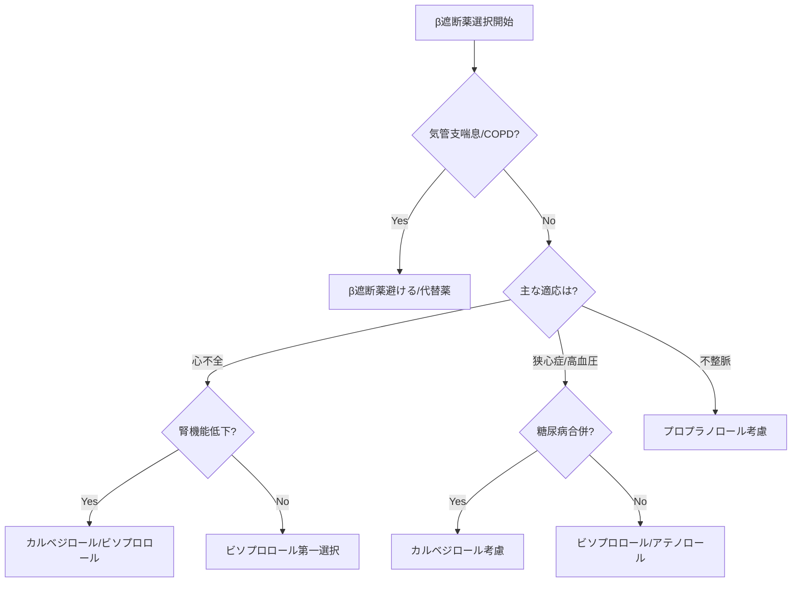

# β遮断薬進化系統図と臨床使い分けモデル

## 🧬 β遮断薬進化の系譜

### 第1世代（1964年〜）：非選択的β遮断薬
#### プロプラノロール（インデラル®）
- **開発背景**：狭心症治療薬として世界初のβ遮断薬
- **革新点**：
  - β受容体遮断という新しい作用機序
  - 狭心症・不整脈・高血圧に有効
  - ノーベル賞受賞（James Black, 1988）
- **課題**：
  - β2受容体も遮断→気管支喘息で禁忌
  - 脂溶性高く中枢移行→悪夢・抑うつ
  - 半減期短い（3-6時間）

### 第2世代（1970年代〜）：β1選択的遮断薬
#### アテノロール（テノーミン®）
- **開発背景**：気管支への影響を最小化
- **特徴**：
  - β1選択性により呼吸器系への影響軽減
  - 水溶性で中枢移行少ない
  - 1日1回投与可能
- **限界**：腎排泄型で腎機能低下時は注意

#### メトプロロール（セロケン®/ロプレソール®）
- **開発背景**：心保護作用を重視
- **特徴**：
  - 脂溶性でβ1選択的
  - 心筋梗塞後の予後改善エビデンス
  - 徐放剤で1日1回投与
- **注意点**：CYP2D6で代謝（個人差大）

#### ビソプロロール（メインテート®）
- **開発背景**：最高のβ1選択性を追求
- **革新点**：
  - β1/β2選択性比 75:1（最高レベル）
  - 心不全治療のエビデンス確立（CIBIS-II試験）
  - 半減期10-12時間で安定した効果
- **現在の位置づけ**：心不全治療の第一選択

### 第3世代（1990年代〜）：付加価値型
#### カルベジロール（アーチスト®）
- **開発背景**：β遮断＋α遮断の相乗効果
- **独自性**：
  - 非選択的β遮断＋α1遮断作用
  - 抗酸化作用
  - 心不全での死亡率減少（COPERNICUS試験）
- **課題**：起立性低血圧のリスク

#### ネビボロール（本邦未承認）
- **開発背景**：血管拡張作用の付加
- **特徴**：
  - 高度β1選択性＋NO産生促進
  - 代謝への好影響
  - 勃起不全の副作用少ない

## 💊 臨床使い分けマトリックス

### 疾患別の第一選択

| 疾患/病態 | 推奨β遮断薬 | 理由 |
|----------|------------|------|
| 慢性心不全 | ビソプロロール/カルベジロール/メトプロロール | 3剤のみ死亡率減少のエビデンス |
| 労作性狭心症 | ビソプロロール/アテノロール | 長時間作用、ISA(-)で確実な徐脈 |
| 心筋梗塞後 | メトプロロール/カルベジロール | 心筋保護作用、予後改善 |
| 頻脈性不整脈 | プロプラノロール（静注） | 即効性、確実な効果 |
| 高血圧（若年） | ビソプロロール | 高いβ1選択性、1日1回 |
| 高血圧（高齢） | アテノロール/ビソプロロール | 低用量から開始、腎機能注意 |
| 甲状腺機能亢進症 | プロプラノロール | 末梢でのT4→T3変換抑制 |
| 片頭痛予防 | プロプラノロール | 中枢移行による予防効果 |
| 本態性振戦 | プロプラノロール | 末梢β2遮断による振戦抑制 |

### 併存疾患での選択基準

| 併存疾患 | 推奨 | 避けるべき | 理由 |
|---------|------|-----------|------|
| 気管支喘息 | 使用しない | 全β遮断薬 | 気管支攣縮リスク |
| COPD（軽症） | ビソプロロール（低用量） | 非選択的 | β1選択性最高 |
| 糖尿病 | カルベジロール | 非選択的 | α遮断で糖代謝改善 |
| 末梢動脈疾患 | カルベジロール | 高用量β遮断薬 | α遮断で血管拡張 |
| 腎機能低下 | メトプロロール/ビソプロロール | アテノロール | 肝代謝中心 |
| 肝機能低下 | アテノロール | プロプラノロール | 腎排泄型 |
| 妊娠 | メトプロロール/ラベタロール | アテノロール | 胎児発育遅延リスク低い |

## 🚨 気管支喘息での対応戦略

### リスク階層
```
絶対禁忌：プロプラノロール（非選択的）
     ↓
相対禁忌：アテノロール、メトプロロール（β1選択的）
     ↓
慎重投与：ビソプロロール（超選択的、低用量）
     ↓
代替薬剤：Ca拮抗薬、ARB/ACE阻害薬
```

### 喘息患者での代替戦略
1. **狭心症**：Ca拮抗薬（ジルチアゼム）＋硝酸薬
2. **心不全**：ARB/ACE阻害薬＋利尿薬（β遮断薬なしでも開始）
3. **不整脈**：アミオダロン、ベラパミル
4. **高血圧**：ARB/ACE阻害薬＋Ca拮抗薬

## 📊 薬理学的パラメータ比較

### 主要β遮断薬の特性一覧

| 薬剤名 | β1選択性 | ISA | 脂溶性 | 半減期 | 代謝経路 |
|--------|---------|-----|--------|--------|----------|
| プロプラノロール | なし | - | +++ | 3-6時間 | 肝（CYP2D6） |
| アテノロール | ++ | - | + | 6-7時間 | 腎（50%） |
| メトプロロール | ++ | - | ++ | 3-7時間 | 肝（CYP2D6） |
| ビソプロロール | +++ | - | ++ | 10-12時間 | 肝50%/腎50% |
| カルベジロール | なし* | - | +++ | 7-10時間 | 肝（CYP2D6/2C9） |

*α1遮断作用あり

### 心不全用量（目標用量）
```
ビソプロロール：1.25mg → 10mg/日
カルベジロール：3.125mg → 20-25mg/日（体重により）
メトプロロール：12.5mg → 200mg/日（徐放剤）
```

## 🔄 処方選択フローチャート



## 🔗 他の循環器薬との相互関係

### ARBとの併用
- **理論的根拠**：異なる機序で心保護作用
- **推奨される場面**：心不全、心筋梗塞後
- **注意点**：過度の降圧、高カリウム血症

### ACE阻害薬との使い分け
- **ACE阻害薬優先**：糖尿病性腎症、空咳なし
- **β遮断薬優先**：労作性狭心症、頻脈傾向
- **併用推奨**：心不全（両剤必須）

### 利尿薬との相互作用
- **チアジド系**：糖代謝悪化に注意
- **ループ利尿薬**：心不全では併用必須
- **K保持性**：高カリウム血症リスク

## 📝 実際の処方例

### 症例1：58歳男性、陳旧性心筋梗塞、EF 35%、軽症COPD
```
処方：ビソプロロール 1.25mg 1日1回朝食後
理由：
- 心不全のエビデンスあり
- 最高のβ1選択性でCOPDリスク最小
- 低用量から開始し、2週毎に倍量
目標：安静時心拍数60/分、最大10mg/日
併用：エナラプリル、スピロノラクトン
```

### 症例2：42歳女性、労作性狭心症、気管支喘息既往
```
処方：ジルチアゼムR 100mg 1日2回（β遮断薬は使用せず）
理由：
- 喘息既往でβ遮断薬は高リスク
- Ca拮抗薬で心拍数・血圧コントロール
- 必要時ニトログリセリン舌下錠併用
代替案：イバブラジン（Ifチャネル阻害薬）考慮
```

### 症例3：75歳男性、慢性心不全（HFrEF）、CKD stage 3
```
処方：カルベジロール 3.125mg 1日2回
理由：
- 心不全エビデンスあり、腎機能低下でも使用可
- α遮断作用で後負荷軽減
- 肝代謝中心で腎への負担少ない
目標：25mg/日まで漸増（血圧・心拍数見ながら）
```

### 症例4：50歳男性、高血圧、2型糖尿病、BMI 28
```
処方：カルベジロール 10mg 1日2回
理由：
- α遮断作用でインスリン抵抗性改善
- 体重増加しにくい
- ARB（テルミサルタン）と併用で相乗効果
血圧目標：130/80mmHg未満
```

### 症例5：35歳女性、甲状腺機能亢進症、頻脈（120/分）、手指振戦
```
処方：プロプラノロール 30mg 1日3回
理由：
- T3変換抑制作用あり
- 振戦に対して即効性
- 甲状腺機能正常化まで使用
注意：妊娠可能年齢のため避妊指導
```

## 💡 なぜ似たβ遮断薬が複数存在するのか

1. **臓器選択性の違い**
   - 心臓特異的（β1）vs 全身作用（非選択的）
   - 喘息患者でも使える薬剤の開発

2. **薬物動態の多様性**
   - 腎排泄型：腎機能正常者向け
   - 肝代謝型：腎機能低下者向け
   - 半減期の違い：服薬回数の利便性

3. **付加価値の追求**
   - α遮断（カルベジロール）：血管拡張
   - NO産生（ネビボロール）：内皮機能改善
   - 抗酸化作用：心筋保護

4. **エビデンスの蓄積**
   - 心不全：特定3剤のみ死亡率改善
   - 心筋梗塞後：薬剤により予後が異なる
   - 個別化医療への対応

5. **副作用プロファイルの改善**
   - 中枢移行の違い：精神症状の有無
   - 代謝への影響：糖尿病患者への配慮
   - 男性機能への影響：QOL重視

## 📈 今後の展望

### 新しいコンセプト
- **超長時間作用型**：週1回投与
- **臓器保護特化型**：心臓・腎臓・脳
- **個別化投与**：遺伝子多型に基づく選択

### β遮断薬の再評価
- 高齢者での有用性見直し
- がん予防効果の研究
- 認知症との関連解明

---

*本モデルは2025年6月時点のエビデンスに基づく。ACC/AHA、ESCガイドラインに準拠。*