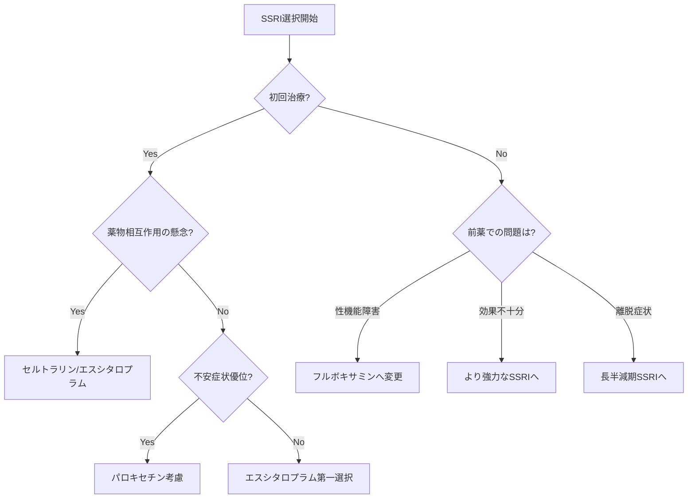

# SSRI（選択的セロトニン再取り込み阻害薬）進化系統図と臨床使い分けモデル

## 📍 5分サマリー

### 薬効群の本質
SSRI（選択的セロトニン再取り込み阻害薬）は、シナプス間隙のセロトニン濃度を選択的に増加させることで抗うつ効果を発揮する薬剤群です。三環系抗うつ薬が持つ重篤な副作用（心毒性、抗コリン作用、致死的過量服薬）を回避しつつ、同等の有効性を実現した革命的な薬剤として、1999年以降日本のうつ病治療を一変させました。

### 主要薬剤一覧（副作用プロファイル重視）
| 薬剤名 | 世代 | 特徴的副作用 | 半減期 | 使い分けポイント |
|--------|------|-------------|--------|-----------------|
| フルボキサミン（デプロメール/ルボックス） | 第1世代 | 眠気+++、嘔気+++ | 9-14時間 | 強迫性障害第一選択、性機能障害少ない |
| パロキセチン（パキシル） | 第2世代 | 離脱症状++++、体重増加+++ | 21時間 | 不安障害に強力、鎮静作用あり |
| セルトラリン（ジェイゾロフト） | 第2世代 | 下痢+++、活性化++ | 26時間 | バランス型、薬物相互作用最小 |
| エスシタロプラム（レクサプロ） | 第3世代 | 副作用最小（嘔気+） | 27-32時間 | 最も選択的、初回治療の第一選択 |

### 処方選択フローチャート（テキスト版）
```
患者評価
├─ 初回治療・副作用不安 → エスシタロプラム（最も忍容性良好）
├─ 不安症状優位 → パロキセチン（強力な抗不安作用）
├─ 強迫性障害 → フルボキサミン（保険適応、高用量可）
├─ 多剤併用・高齢者 → セルトラリン/エスシタロプラム（相互作用少）
├─ 性機能重視 → フルボキサミン（性機能障害頻度低）
└─ 妊娠可能女性 → セルトラリン（安全性データ豊富）
```

### なぜSSRIが必要か（三環系抗うつ薬との決定的違い）
**安全性の革命的向上**：
- **過量服薬安全性**：三環系は致死的、SSRIは比較的安全
- **心毒性回避**：QT延長・不整脈リスクが激減
- **抗コリン作用最小化**：口渇・便秘・尿閉・認知機能低下を回避
- **選択的作用**：セロトニン系のみに作用し、予測可能な副作用プロファイル

**パロキセチンがシェアトップの真実**：「最強の効果」というブランディング、不安への即効性、医師の「効かないリスク」回避心理、そして皮肉にも「離脱症状＝効いている証拠」という誤解が、処方継続を生む構造。薬の選択は薬理学だけでなく、医師と患者の心理が深く影響することをSSRIは物語っています。

### 離脱症候群への配慮
- **高リスク**：パロキセチン（半減期短い＋強力な作用）
- **中リスク**：フルボキサミン（半減期最短）
- **低リスク**：セルトラリン、エスシタロプラム（半減期長い）
- **対策**：2-4週かけた漸減、必要時は長半減期薬へのブリッジング

### 📖 詳細解説へ
以下、各SSRIの詳細な進化系統、CYP阻害プロファイル、症例別の具体的処方例、そして「なぜ日本でパロキセチンが支持され続けるのか」という処方文化の深層に迫ります。

---

## 🧬 SSRI進化の系統樹

### 第1世代（1999年〜）：日本上陸のパイオニア
#### フルボキサミン（デプロメール®/ルボックス®）
- **開発背景**：日本初のSSRI、三環系抗うつ薬の副作用軽減を目指す
- **特徴**：
  - 最短半減期（9-14時間）
  - CYP1A2強力阻害（カフェイン相互作用）
  - 比較的マイルドな作用
- **課題**：
  - 1日2回投与が基本
  - 消化器症状が出やすい
  - 眠気の頻度が高い
- **現在の位置づけ**：強迫性障害での第一選択、軽症うつ病

### 第2世代（2000年〜）：本格的SSRI時代
#### パロキセチン（パキシル®）
- **開発背景**：強力な抗うつ効果を追求
- **特徴**：
  - 最強のセロトニン再取り込み阻害作用
  - 抗コリン作用を若干持つ（鎮静効果）
  - 不安障害への効果が高い
- **課題**：
  - 離脱症状が最も強い（半減期21時間）
  - 体重増加のリスク
  - CYP2D6強力阻害
- **現在の位置づけ**：パニック障害、社交不安障害で有効

#### セルトラリン（ジェイゾロフト®）
- **開発背景**：バランス型SSRIを目指す
- **特徴**：
  - 中間的な半減期（26時間）
  - 薬物相互作用が少ない（CYP阻害弱い）
  - 活性化作用と鎮静作用のバランス
- **課題**：
  - 下痢などの消化器症状
  - 初期の不安増強
- **現在の位置づけ**：第一選択として使いやすい

### 第3世代（2011年〜）：洗練されたSSRI
#### エスシタロプラム（レクサプロ®）
- **開発背景**：シタロプラムのS体（活性本体）のみを抽出
- **革新点**：
  - 最も選択的なセロトニン再取り込み阻害
  - 副作用プロファイルが最も軽い
  - 効果発現が比較的早い（2-4週）
- **特徴**：
  - 半減期27-32時間で安定
  - 薬物相互作用が最小限
  - 用量依存的な効果
- **課題**：
  - 高用量でQT延長リスク
  - 薬価が高い（後発品登場で改善）
- **現在の位置づけ**：多くのガイドラインで第一選択

## 💊 臨床使い分けマトリックス

### 患者背景別の第一選択

| 患者背景 | 推奨SSRI | 理由 |
|---------|----------|------|
| 若年者（18-25歳）初発うつ | エスシタロプラム | 副作用最小、アクチベーション管理しやすい |
| 高齢者（65歳以上） | セルトラリン/エスシタロプラム | 薬物相互作用少ない、認知機能への影響小 |
| 不安障害優位 | パロキセチン | 抗不安作用強力、鎮静作用あり |
| 強迫性障害 | フルボキサミン | 保険適応あり、高用量使用可能 |
| 肝機能障害 | セルトラリン | 肝代謝への依存度が低い |
| 多剤併用患者 | セルトラリン/エスシタロプラム | CYP阻害作用が弱い |
| 性機能重視 | フルボキサミン | 性機能障害の頻度が比較的低い |
| 妊娠可能女性 | セルトラリン | 比較的安全性データが豊富 |

### 副作用プロファイル比較

| 副作用 | フルボキサミン | パロキセチン | セルトラリン | エスシタロプラム |
|--------|---------------|--------------|-------------|----------------|
| 嘔気・嘔吐 | +++ | ++ | +++ | + |
| 性機能障害 | + | +++ | ++ | ++ |
| 体重増加 | + | +++ | + | + |
| 眠気 | +++ | ++ | + | + |
| 離脱症状 | ++ | ++++ | + | + |
| 活性化症候群 | + | + | ++ | ++ |

（+：軽度、++：中等度、+++：高度、++++：重度）

## 📊 薬物動態パラメータと臨床的意義

### 半減期と離脱症状の関係

```
パロキセチン    ：21時間  → 離脱症状リスク 高
フルボキサミン  ：9-14時間 → 離脱症状リスク 中
セルトラリン    ：26時間  → 離脱症状リスク 低
エスシタロプラム：27-32時間 → 離脱症状リスク 低
```

### 離脱症状対策
1. **漸減スケジュール**（パロキセチンの例）
   ```
   20mg → 15mg（2週間）→ 10mg（2週間）→ 5mg（2週間）→ 2.5mg（1週間）→ 中止
   ```

2. **ブリッジング**
   - 短半減期SSRI → 長半減期SSRI（フルオキセチン等）への切替後に中止

### CYP阻害強度と薬物相互作用

| SSRI | CYP1A2 | CYP2C9 | CYP2C19 | CYP2D6 | CYP3A4 |
|------|--------|--------|---------|--------|--------|
| フルボキサミン | ++++ | ++ | +++ | + | ++ |
| パロキセチン | + | + | + | ++++ | + |
| セルトラリン | + | + | + | + | + |
| エスシタロプラム | - | - | + | + | - |

### 重要な相互作用例
- **フルボキサミン**：カフェイン、テオフィリン、ワルファリン
- **パロキセチン**：タモキシフェン、三環系抗うつ薬、抗精神病薬
- **セルトラリン**：相互作用は比較的少ない
- **エスシタロプラム**：相互作用は最小限

## 🔄 SSRI選択フローチャート



## 📈 用量設定と titration 戦略

### 開始用量と最大用量

| SSRI | 開始用量 | 通常用量 | 最大用量 | 増量間隔 |
|------|---------|---------|---------|----------|
| フルボキサミン | 25-50mg/日 | 100-150mg/日 | 300mg/日 | 1-2週間 |
| パロキセチン | 10-20mg/日 | 20-40mg/日 | 50mg/日 | 1-2週間 |
| セルトラリン | 25-50mg/日 | 50-100mg/日 | 200mg/日 | 1週間 |
| エスシタロプラム | 5-10mg/日 | 10-20mg/日 | 20mg/日 | 1週間 |

### 特殊集団での調整
- **高齢者**：開始用量を半量に
- **肝機能障害**：最大用量を制限
- **腎機能障害**：セルトラリン以外は調整不要

## 💡 実際の処方例と選択理由

### 症例1：23歳女性、大学生、初発うつ病エピソード
```
診断：中等症うつ病、不眠傾向
処方：エスシタロプラム 5mg 1日1回朝食後
      （2週間後に10mgへ増量）

選択理由：
- 初回治療で副作用への不安が強い
- 学業への影響を最小限にしたい
- 活性化作用による不眠悪化を避けるため低用量開始
- 将来的な妊娠も考慮し、離脱しやすい薬剤選択
```

### 症例2：45歳男性、パニック障害、予期不安著明
```
診断：パニック障害、広場恐怖
処方：パロキセチン 10mg 1日1回夕食後
      （1週間後に20mg、その後30mgまで漸増）

選択理由：
- 強い抗不安作用が必要
- 鎮静作用で予期不安も軽減期待
- 夕食後投与で日中の眠気を回避
- パニック障害への有効性エビデンス豊富
```

### 症例3：68歳男性、軽症うつ病、多剤併用（ワルファリン、アムロジピン）
```
診断：老年期うつ病、心房細動で抗凝固療法中
処方：セルトラリン 25mg 1日1回朝食後
      （4週間後に50mgへ増量）

選択理由：
- CYP阻害作用が弱くワルファリンへの影響最小
- 高齢者でも忍容性良好
- 心血管系への影響が少ない
- 認知機能への悪影響なし
```

### 症例4：35歳女性、強迫性障害、確認行為で日常生活支障
```
診断：強迫性障害（確認強迫）
処方：フルボキサミン 50mg 1日2回（朝夕食後）
      （段階的に200mg/日まで増量予定）

選択理由：
- 強迫性障害に保険適応
- 高用量使用が可能（最大300mg）
- 分割投与で血中濃度を安定
- エビデンスレベルが最も高い
```

## 🔄 SSRI間の切り替え戦略

### 直接切り替え（Cross-tapering）
適応：セルトラリン ⇔ エスシタロプラム

### 漸減後切り替え
適応：パロキセチンから他剤へ

### Washout期間設定
適応：フルボキサミンから他剤へ（CYP阻害の影響除去）

### 切り替え例：パロキセチン → エスシタロプラム
```
Week 1-2: パロキセチン 20mg → 10mg
Week 3-4: パロキセチン 10mg + エスシタロプラム 5mg
Week 5-6: パロキセチン 5mg + エスシタロプラム 10mg  
Week 7:   エスシタロプラム 10mg単独
```

## 📊 エビデンスに基づく有効性比較

### メタアナリシスによる効果サイズ
1. **エスシタロプラム**：0.32（最も高い）
2. **セルトラリン**：0.30
3. **パロキセチン**：0.28
4. **フルボキサミン**：0.24

### 寛解率（12週時点）
- エスシタロプラム：47-55%
- セルトラリン：44-50%
- パロキセチン：43-48%
- フルボキサミン：40-45%

## 🚨 安全性モニタリングのポイント

### 開始2週間以内
- アクチベーション症候群（焦燥、不眠、自殺念慮）
- 消化器症状のマネジメント
- セロトニン症候群の早期発見

### 長期使用時
- 性機能障害の評価（3ヶ月毎）
- 体重変化のモニタリング
- 骨密度への影響（高齢者）
- 電解質異常（SIADH）

## 💭 なぜ複数のSSRIが必要なのか

1. **個人差への対応**：セロトニントランスポーター遺伝子多型
2. **副作用プロファイルの違い**：患者のライフスタイルに応じた選択
3. **薬物相互作用の回避**：併用薬に応じた使い分け
4. **エビデンスの蓄積**：特定の疾患での優位性

---

*この詳細モデルにより、個々の患者に最適なSSRIを選択し、安全で効果的な薬物療法を実現します*