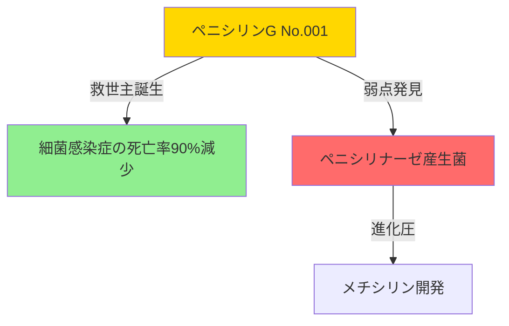

# 抗生物質生態系マップ

## 🌍 1940-2025年：抗生物質と耐性菌の共進化

### 第1世代：黄金時代（1940-1960）


### 第2世代：軍拡競争（1960-1980）
```
🦠 細菌側の進化          💊 人類側の対抗

ペニシリナーゼ獲得  →  メチシリン（1960）
     ↓                    ↓
MRSA出現（1961）    →  セフェム系第1-3世代
     ↓                    ↓  
ESBL産生菌         →  カルバペネム系
```

### 第3世代：多様化戦略（1980-2000）
```
         [中央司令塔]
           ↓
    ┌─────┴─────┬─────┬─────┐
    │           │     │     │
 ペニシリン系  セフェム系  キノロン系  マクロライド系
    │           │     │     │
    ↓           ↓     ↓     ↓
 [専門化]    [世代進化] [広域化] [非定型菌]
```

### 第4世代：最終防衛線（2000-2025）

#### 🔴 レッドゾーン（多剤耐性菌）
- **CRE**（カルバペネム耐性腸内細菌）
- **XDR-TB**（超多剤耐性結核）
- **PDR**（汎耐性菌）

#### 🛡️ 人類の切り札
- **バンコマイシン**（No.090→900）：最終防衛線
- **リネゾリド**：VRE対応
- **コリスチン**：最後の手段

## 🔗 相互作用ネットワーク

### 相乗効果（シナジー）
```
βラクタム系 + アミノグリコシド系
    ↓
細胞壁破壊 + タンパク合成阻害
    ↓
相乗的殺菌効果（1+1=3）
```

### 拮抗作用（アンタゴニズム）
```
静菌的抗生物質 + 殺菌的抗生物質
    ↓
効果の打ち消し合い
    ↓
治療失敗リスク
```

## 🎮 ゲーム内生態系イベント

### イベント1：「院内感染アウトブレイク」
**状況**：ICUでMRSA集団感染発生
**選択肢**：
1. バンコマイシン一斉投与
2. 感染対策強化＋標的治療
3. 新薬治験参加

**結果**：選択により耐性菌の進化速度が変化

### イベント2：「抗菌薬適正使用キャンペーン」
**ミッション**：広域抗菌薬の使用を50%削減
**報酬**：耐性化速度の低下、新薬開発ポイント

### イベント3：「Next Pandemic - 未知の耐性菌」
**2030年予測シナリオ**
- 既存薬すべて無効
- プレイヤーの選択が人類の未来を決める
- 国際協力 or 独自開発？

## 📊 生態系健全度メーター

### 現在の状態（2025年）
```
抗生物質の多様性：■■■■■■□□□□ 60%
耐性菌の脅威度：■■■■■■■■□□ 80%
新薬開発速度：■■■□□□□□□□ 30%
適正使用率：■■■■■□□□□□ 50%
```

## 🔮 未来予測

### 2030年シナリオA：協調路線
- ファージ療法実用化
- AI創薬で耐性回避
- 国際的な使用規制

### 2030年シナリオB：破滅路線
- 汎耐性菌の蔓延
- 抗生物質後の時代
- 外科手術不可能に

## 教育メッセージ

「抗生物質は有限の資源。次世代に残すために、今、適正使用を」

「薬剤師は生態系の守護者。バランスを保つことが使命」

---

## 実装メモ

### 必要な技術
- リアルタイム生態系シミュレーション
- 機械学習による耐性パターン予測
- マルチエンディングシステム

### データソース
- WHO耐性菌サーベイランス
- 各国の抗菌薬使用量データ
- 最新の臨床研究