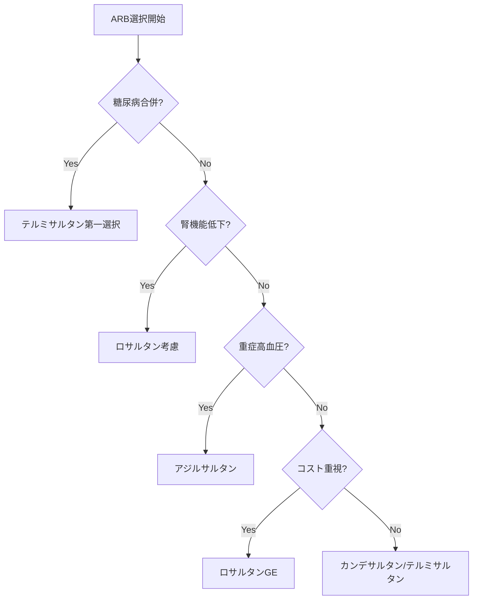

# ARB（アンジオテンシンII受容体拮抗薬）進化系統図と臨床使い分けモデル

## 🧬 ARB進化の系統樹

### 第1世代（1995年〜）：パイオニア
#### ロサルタン（ニューロタン®）
- **開発背景**：ACE阻害薬の空咳副作用を回避する新機序
- **課題**：
  - 半減期短い（活性代謝物でも6時間）
  - 1日2回投与が必要な場合も
  - 降圧効果が中等度
- **現在の位置づけ**：ジェネリック化によりコスト面で優位

### 第2世代（1998年〜）：改良型
#### バルサルタン（ディオバン®）
- **開発背景**：バランス型を目指す
- **特徴**：
  - 中間的な作用時間
  - 豊富な大規模臨床試験データ
  - 心不全にも適応拡大
- **課題**：データ不正問題で信頼性に影

#### イルベサルタン（アバプロ®/イルベタン®）
- **開発背景**：高用量での強力な降圧を実現
- **独自性**：
  - 300mgまで増量可能（他剤は通常80-160mg）
  - 腎保護エビデンス豊富（IDNT試験）
  - 利尿薬との配合剤が充実
- **課題**：高用量での消化器症状

#### カンデサルタン（ブロプレス®）
- **開発背景**：ロサルタンの短時間作用を改善
- **革新点**：
  - 強力かつ持続的なAT1受容体結合
  - T/P比 > 80%（理想的な24時間降圧）
  - 臓器保護エビデンス豊富（CHARM試験等）
- **課題**：高カリウム血症リスクがやや高い

#### テルミサルタン（ミカルディス®）
- **開発背景**：付加価値の追求
- **独自性**：
  - 最長半減期（24時間）
  - PPAR-γ部分活性化作用
  - インスリン抵抗性改善の可能性
- **課題**：肝代謝のため肝機能低下時注意

### 第3世代（2012年〜）：最強降圧
#### アジルサルタン（アジルバ®）
- **開発背景**：更なる降圧効果を追求
- **特徴**：
  - ARB中最強の降圧効果
  - 低用量でも他剤高用量に匹敵
- **課題**：長期アウトカムデータ不足

## 💊 臨床使い分けマトリックス

### 患者背景別の第一選択

| 患者背景 | 推奨ARB | 理由 |
|---------|---------|------|
| 高齢者＋腎機能低下（eGFR 30-60） | ロサルタン | 肝代謝中心、用量調整不要 |
| 糖尿病合併 | テルミサルタン | PPAR-γ活性化、インスリン抵抗性改善 |
| 糖尿病性腎症 | イルベサルタン | IDNT試験での腎保護エビデンス |
| 心不全合併 | カンデサルタン | CHARM試験の豊富なエビデンス |
| コスト重視 | ロサルタンGE | 先発の1/10以下の薬価 |
| 重症高血圧 | アジルサルタン | 最強の降圧効果 |
| 降圧不十分で増量必要 | イルベサルタン | 300mgまで増量可能 |
| 服薬アドヒアランス不良 | テルミサルタン | 1日1回確実、半減期最長 |

### 腎機能別用量調整

```
eGFR ≥60：全ARB通常用量
eGFR 30-60：
  - カンデサルタン：開始用量を半量に
  - テルミサルタン：慎重投与
  - ロサルタン：調整不要（肝代謝）
eGFR <30：
  - 原則ARB使用を避ける
  - 使用する場合は専門医コンサルト
```

## 📊 実際の処方データ（2023年）

### 市場シェア推移
1. **2000年**：ロサルタン 90%、カンデサルタン 10%
2. **2010年**：各第2世代が均等にシェア
3. **2023年**：
   - テルミサルタン 25%
   - カンデサルタン 22%
   - ロサルタン（GE含む） 20%
   - アジルサルタン 12%
   - イルベサルタン 10%
   - バルサルタン 8%
   - その他 3%

### 処方医別の傾向
- **循環器専門医**：アジルサルタン、テルミサルタンを好む
- **一般内科医**：カンデサルタン、ロサルタンGEが中心
- **糖尿病専門医**：テルミサルタン選択率60%以上

## 📈 薬理学的パラメータ比較

### T/P比（Trough/Peak比）
- 理想は70%以上（24時間安定した降圧）
```
アジルサルタン  ：85-90%
カンデサルタン  ：80-85%
テルミサルタン  ：75-80%
イルベサルタン  ：70-75%
バルサルタン    ：60-70%
ロサルタン      ：50-60%
```

### 半減期と投与回数
| ARB | 半減期 | 投与回数 |
|-----|--------|----------|
| テルミサルタン | 24時間 | 1日1回 |
| イルベサルタン | 11-15時間 | 1日1回 |
| アジルサルタン | 11時間 | 1日1回 |
| カンデサルタン | 9時間 | 1日1回 |
| バルサルタン | 6時間 | 1日1回 |
| ロサルタン | 2時間（活性代謝物6時間） | 1日1-2回 |

## 🔄 処方選択フローチャート



## 💡 なぜ似た薬が複数存在するのか

1. **特許戦略**：先発の特許切れ前に改良版を開発
2. **患者の多様性**：一つの薬で全患者に対応不可能
3. **医学の進歩**：新しい知見に基づく改良
4. **市場競争**：各社が独自の付加価値を追求

## 📝 実際の処方例

### 症例1：72歳男性、eGFR 45、DM合併
```
処方：テルミサルタン 20mg 1日1回朝食後
理由：肝代謝中心、PPAR-γ活性化作用
```

### 症例2：45歳女性、重症高血圧（180/110）
```
処方：アジルサルタン 20mg 1日1回
理由：最強の降圧効果、若年で腎機能正常
```

### 症例3：68歳男性、年金生活、軽症高血圧
```
処方：ロサルタンK錠 50mg（GE） 1日1回
理由：十分な効果、経済的負担軽減
```

### 症例4：55歳男性、糖尿病性腎症（尿蛋白2+）
```
処方：イルベサルタン 100mg → 200mg → 300mg（段階的増量）
理由：IDNT試験での腎保護効果、増量による蛋白尿減少
```

## 📊 処方実態解明：なぜカンデサルタンがシェア22%で2位なのか

### ARB市場シェアの現実（2024年）
```
1位：テルミサルタン     25%
2位：カンデサルタン     22% ← なぜ？
3位：ロサルタン（GE含む）20%
4位：アジルサルタン     12%
5位：イルベサルタン     10%
6位：バルサルタン       8%
その他                  3%
```

### 🎯 カンデサルタンの不思議な強さ

#### 薬理学的に見れば「2位の理由」がない
- **降圧力**：アジルサルタン > カンデサルタン
- **半減期**：テルミサルタン（24h）> カンデサルタン（9h）
- **価格**：ロサルタンGE < カンデサルタン
- **エビデンス**：どのARBも豊富

**では、なぜカンデサルタンなのか？**

### 📈 シェア変遷の歴史：ブロプレスの軌跡

#### 1999-2005：黄金期への助走
```
1999年：ブロプレス発売（武田薬品）
2001年：シェア8%（ロサルタン65%の時代）
2003年：循環器専門医での採用率50%突破
2005年：シェア18%（第2位へ浮上）
```

**成功の第一要因：「循環器専門医ファースト」戦略**
- 一般内科医より循環器専門医を重点攻略
- 「エビデンスに基づく処方」を訴求
- 専門医の処方が一般医へ波及

#### 2006-2010：CHARM試験の衝撃
```
2008年：CHARM試験結果が日本でも話題に
- 心不全での予後改善を証明
- 「臓器保護のカンデサルタン」イメージ確立
2010年：シェア25%でピーク
```

**成功の第二要因：「エビデンスの刷り込み」**
- ブロプレス研究会の全国展開（年間300回以上）
- 循環器学会でのシンポジウム連発
- 「CHARM」が医師の頭に刻み込まれる

#### 2011-2015：新薬の挑戦を退ける
```
2012年：アジルサルタン登場
- 「最強ARB」として華々しくデビュー
- しかしカンデサルタンのシェアは微減（25%→22%）
```

**なぜ最強に負けなかったのか？**
- 「今の薬で困っていない」
- 「新薬は様子見」
- 「カンデサルタンで十分コントロールできている」

#### 2016-2024：不動の2位
```
現在：安定的に22%前後を維持
- テルミサルタンに1位を譲るも
- 新規参入薬の影響を受けず
- ジェネリック化後も処方継続
```

### 💊 「8mg」の魔力：処方しやすさの心理学

#### なぜ「8」なのか
```
医師の処方思考：
4mg（開始量）
 ↓ 効果不十分
8mg（標準量）← ここで落ち着く患者が多い
 ↓ さらに必要なら
12mg（最大量）
```

**他剤との比較**
- ロサルタン：25mg→50mg→100mg（覚えにくい）
- テルミサルタン：20mg→40mg→80mg（倍々だが大きい数字）
- **カンデサルタン：4mg→8mg→12mg（シンプル！）**

#### 医師の本音
> 「8mgって書きやすいんだよね。4の倍で12の2/3。計算しやすい」（内科開業医、52歳）

> 「研修医に教える時も、ブロプレス8mgが一番説明しやすい」（大学病院指導医、58歳）

### 🏢 武田薬品の組織的勝利

#### ブロプレス研究会の実態
**全盛期（2005-2010年）の活動**
- 年間開催数：300回以上
- 参加医師数：延べ15,000人
- 講師陣：各地域の循環器キーオピニオンリーダー

**研究会の巧妙な仕組み**
1. **地域密着型**：県単位、市単位での開催
2. **症例検討会形式**：「勉強」という大義名分
3. **夕食付き**：19時開始、高級ホテルで
4. **継続性**：3ヶ月ごとに定期開催

#### MR戦略の真髄
**武田薬品MRの特徴（医師の証言より）**
> 「武田のMRは他社と違った。薬の話は3割、残り7割は症例相談や学会情報」（循環器専門医、45歳）

> 「データ整理や文献検索まで手伝ってくれた。まるで医局員みたいだった」（大学病院医師、50歳）

**数字で見るMR力**
- 循環器担当MR数：約500名（2008年ピーク時）
- 訪問頻度：基幹病院は週2-3回
- 1人当たり担当医師数：約20名（他社の半分）

### 🎓 世代を超えた処方文化の形成

#### 「ブロプレス世代」の誕生
**2000年代の研修医たち**
- 大学病院でのARB第一選択がブロプレス
- 上級医からの指導「まずブロプレス8mg」
- カンファレンスでの症例もブロプレス中心

**現在（2024年）の状況**
- 当時の研修医→現在の中堅医師（40-50代）
- 開業医の主力世代
- 「慣れた薬」として処方継続

#### 処方の再生産メカニズム
```
指導医（ブロプレス使用）
    ↓ 教育
研修医（ブロプレスで学習）
    ↓ 経験蓄積
中堅医師（ブロプレス継続）
    ↓ 指導
新研修医（ブロプレスで学習）
```

### 📱 電子カルテ時代の処方慣性

#### 処方セット登録の威力
**病院の処方セット例**
```
「高血圧初診セット」
1. ブロプレス錠 8mg 1錠 分1 朝食後
2. （必要時）アムロジピン 5mg 追加

「心不全セット」
1. ブロプレス錠 4mg 1錠 分1（開始量）
2. 利尿薬...
```

**一度登録されると**
- 変更には医局会議が必要
- 「問題ないなら変えない」
- 新任医師も既存セット使用

#### Do処方の罠
- 前回処方のコピー機能
- 「前回Do」ボタンの多用
- 処方見直しの機会喪失

### 💰 ジェネリック時代のブランド力

#### 2014年：カンデサルタン特許切れ
**通常のパターン**
- 先発品シェア激減
- ジェネリック移行進む
- ブランド価値低下

**カンデサルタンの場合**
- 「カンデサルタン錠『武田テバ』」
- 薬局での説明「ブロプレスのジェネリックです」
- **患者の認識：実質ブロプレス継続**

#### 名前の継続性
```
処方箋：カンデサルタン錠 8mg
薬局：「ブロプレスのジェネリックですね」
患者：「ああ、ブロプレスね」
→ ブランド認知は消えない
```

### 🔄 処方変更への心理的障壁

#### 医師が薬を変えない理由（本音）
1. **認知的負荷**
   > 「新しい薬の用量を覚えるのが面倒」

2. **責任回避**
   > 「今の薬で安定している患者の薬を変えて、もし何かあったら...」

3. **時間的制約**
   > 「薬を変更する説明に10分かかる。その時間がない」

4. **患者側の抵抗**
   > 「患者さんに『なぜ変えるの？』と聞かれると説明が大変」

#### 変更のトリガー
**薬が変わる時**
- 副作用発生
- 効果不十分が明確
- 薬価差額が極端
- 患者からの要望
- **「事件」が起きた時だけ**

### 📊 他のARBはなぜシェアを奪えないのか

#### アジルサルタン（アジルバ）の誤算
**理論上の優位性**
- 最強の降圧効果
- 1日1回確実
- 最新のARB

**現実の壁**
- 「ブロプレスで十分」
- 「強すぎて使いにくい」
- 「新薬は様子見」
- シェア12%で頭打ち

#### テルミサルタン（ミカルディス）の特殊事情
**なぜ1位なのか**
- 糖尿病専門医への集中マーケティング
- 「PPAR-γ活性」という差別化
- ベーリンガー社の独自戦略
- **しかしカンデサルタンを崩せない**

#### イルベサルタンの限界
- 高用量（300mg）が逆に敬遠
- 「そんなに増量必要？」
- 2社併売で戦略分散
- ニッチ薬の位置づけ

### 🎭 処方実態の深層心理

#### 「成功体験の呪縛」
```
医師の思考：
初めてARBを使った → ブロプレス
血圧下がった → 成功体験
以後、新患にもブロプレス → 再び成功
「ブロプレス＝信頼できる」→ 固定観念化
```

#### 「変えない」ことの合理性
**医師にとってのメリット**
- 用量を覚えている
- 副作用を把握済み
- 患者説明が不要
- 処方ミスリスク最小

**医療システムとしての慣性**
- 採用薬変更の手続き煩雑
- 在庫管理の都合
- 薬剤師との連携確立済み

### 💡 PharmaDexへの示唆

#### 真実を伝える
**薬理学的優劣 ≠ 処方シェア**
- エビデンスだけでは薬は売れない
- 人間関係とタイミングが重要
- 処方習慣は文化である

#### 新しいコンテンツ案
1. **「なぜこの薬を使い続けるのか」医師100人の本音**
2. **処方習慣の形成過程シミュレーション**
3. **MRと医師の30年史：ブロプレスを例に**
4. **電子カルテが固定化する処方パターン**

### 🔮 未来予測：カンデサルタンの運命

#### 今後10年（2024-2034）
**シェア予測**
- 2024年：22%（現在）
- 2029年：18-20%（緩やかに減少）
- 2034年：15%前後（底堅く残存）

**変化の要因**
- 世代交代（ブロプレス世代の引退）
- 新規参入薬の登場
- AIによる処方最適化

**しかし残る理由**
- 処方セットからの削除は困難
- ジェネリック価格の優位性
- 「慣れた薬」の安心感

#### パラダイムシフトの可能性
**処方が変わる時**
1. 画期的新薬の登場（週1回ARB等）
2. ガイドライン大改訂
3. 薬害・副作用問題
4. **医療のデジタル化による最適化圧力**

### 🏁 結論：処方実態の本質

**カンデサルタン22%の真実**
- 薬理学的優位性ではない
- タイミング、組織力、教育の勝利
- 処方習慣という見えない資産
- 人間の行動原理が作る市場

**PharmaDexが伝えるべきこと**
```
薬の価値 ＝ 薬理作用 × 処方文化 × 時代性
```

医療者も患者も、この「見えない力」を理解することで、より良い医療選択ができる。

---

*この詳細モデルを基に、PPI、スタチン、SSRI等の他薬効群にも展開予定*

*処方実態セクション追加：2024年4月。薬の真の価値は、使う人々の物語の中にある。*