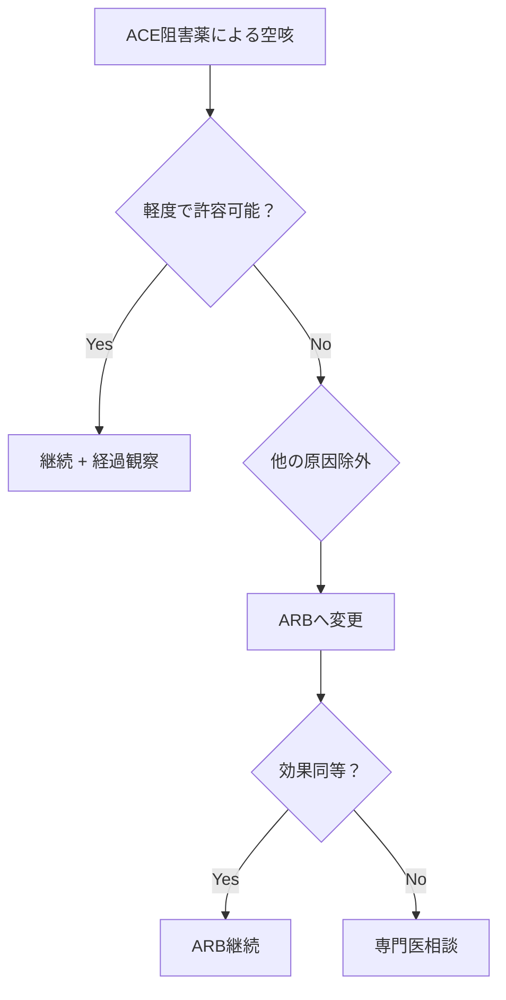
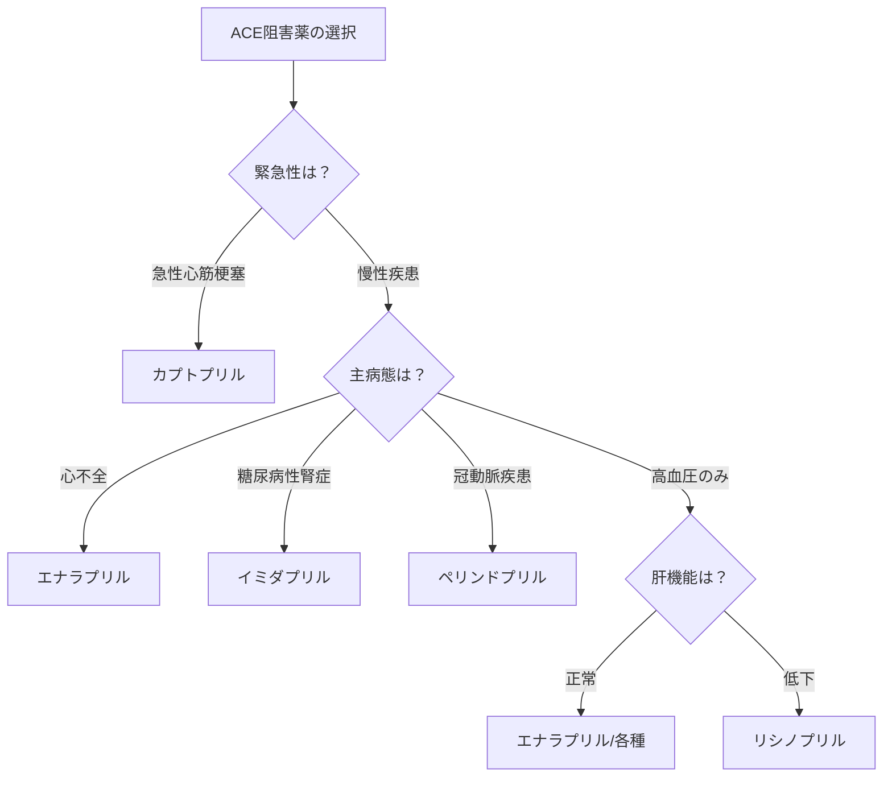

# ACE阻害薬（アンジオテンシン変換酵素阻害薬）進化系統図と臨床使い分けモデル

## 🧬 ACE阻害薬進化の系統樹

### 第1世代（1981年〜）：革命の始まり
#### カプトプリル（カプトリル®）
- **開発背景**：ブラジルの毒蛇（Bothrops jararaca）の毒から発見
- **革新点**：
  - 世界初の経口ACE阻害薬
  - レニン・アンジオテンシン系を標的とした新機序
  - 高血圧治療に革命をもたらす
- **課題**：
  - 短時間作用（半減期2時間）
  - 1日3回投与が必要
  - SH基による味覚障害（5-10%）
  - 皮疹、蛋白尿の頻度が高い
- **現在の位置づけ**：緊急時の昇圧に対する即効性を活かした使用

### 第2世代（1985年〜）：実用性の向上
#### エナラプリル（レニベース®）
- **開発背景**：カプトプリルの欠点を改良
- **改良点**：
  - プロドラッグ化により作用時間延長
  - 1日1-2回投与で可能
  - SH基を持たず味覚障害が少ない
  - 副作用プロファイルの改善
- **特徴**：
  - 活性体エナラプリラートに変換
  - 大規模臨床試験のエビデンス豊富（SOLVD試験等）
  - 心不全の標準治療薬として確立
- **課題**：肝代謝が必要なため肝機能低下時は効果減弱

#### リシノプリル（ゼストリル®/ロンゲス®）
- **開発背景**：プロドラッグではない長時間作用型
- **特徴**：
  - 水溶性で肝代謝不要
  - 腎排泄型（腎機能に応じた用量調整必要）
  - 1日1回投与
  - 食事の影響を受けにくい
- **臨床的位置づけ**：肝機能低下患者での第一選択

### 第3世代（1990年代〜）：組織親和性の追求
#### ペリンドプリル（コバシル®）
- **開発背景**：組織ACEへの親和性向上
- **特徴**：
  - 高い組織移行性
  - 血管内皮保護作用
  - 動脈硬化進展抑制のエビデンス（EUROPA試験）
- **適応拡大**：安定冠動脈疾患での心血管イベント抑制

#### トランドラプリル（プレラン®/オドリック®）
- **特徴**：
  - 脂溶性が高く組織移行性良好
  - 心筋梗塞後の心機能改善効果（TRACE試験）
  - 1日1回投与

### 第4世代（2000年代〜）：付加価値の追求
#### イミダプリル（タナトリル®）
- **日本発**：田辺三菱製薬が開発
- **特徴**：
  - ACE/NEP（ネプリライシン）二重阻害作用
  - 腎保護作用が強い
  - 日本人での豊富なエビデンス
- **適応**：糖尿病性腎症への積極的使用

## 🔄 ACE阻害薬 vs ARB：なぜ両方が必要か？

### 作用機序の違いと臨床的意義

| 特徴 | ACE阻害薬 | ARB |
|------|----------|-----|
| 作用点 | ACE酵素を阻害 | AT1受容体を遮断 |
| アンジオテンシンII産生 | 抑制（完全ではない） | 産生は抑制しない |
| ブラジキニン | 分解抑制→蓄積 | 影響なし |
| 空咳 | 20-30%に発生 | ほぼなし（<1%） |
| 血管保護作用 | ブラジキニン↑により強い | 中等度 |
| 心血管イベント抑制 | ★★★★★ | ★★★★☆ |
| 腎保護作用 | ★★★★☆ | ★★★★☆ |
| 忍容性 | ★★★☆☆ | ★★★★★ |

### なぜ両方が必要なのか？
1. **空咳不耐容患者**：ACE阻害薬で空咳→ARBへ切り替え（約20-30%）
2. **ブラジキニンの恩恵**：心血管保護作用はACE阻害薬が優位
3. **エビデンスの違い**：心筋梗塞後はACE阻害薬のエビデンスが豊富
4. **併用療法**：重症心不全では両剤併用も考慮（専門医管理下）

## 💊 空咳の発生機序と対処法

### 発生機序
```
ACE阻害 → ブラジキニン分解抑制 → 気道でのブラジキニン蓄積
→ プロスタグランジン産生↑ → 咳受容体刺激 → 空咳
```

### 空咳の特徴
- **発生時期**：投与開始1週間〜数ヶ月
- **頻度**：日本人20-30%（欧米人の2-3倍）
- **性差**：女性に多い（男性の1.5倍）
- **特徴**：痰を伴わない乾性咳嗽、夜間に多い

### 対処法フローチャート


### 実践的対処法
1. **軽度の場合**：2-3ヶ月で軽減することもあり経過観察
2. **中等度**：就寝前投与を朝投与に変更
3. **重度/QOL低下**：ARBへ速やかに変更
4. **変更例**：エナラプリル10mg → カンデサルタン8mg

## 📊 臨床使い分けマトリックス

### 病態別推奨ACE阻害薬

| 病態 | 第一選択 | 理由 | 代替薬 |
|------|---------|------|--------|
| 心不全（HFrEF） | エナラプリル | 豊富なエビデンス（SOLVD、CONSENSUS） | リシノプリル |
| 心筋梗塞後 | カプトプリル/トランドラプリル | 早期開始可能/TRACE試験 | エナラプリル |
| 糖尿病性腎症 | イミダプリル | 腎保護作用、日本人エビデンス | ペリンドプリル |
| 安定冠動脈疾患 | ペリンドプリル | EUROPA試験での心血管イベント抑制 | - |
| 高血圧（単純） | エナラプリル/リシノプリル | コスト効果、1日1回 | 各種ACE阻害薬 |
| 肝機能低下 | リシノプリル | 肝代謝不要 | カプトプリル |
| 高齢者 | 低用量エナラプリル | エビデンス豊富、用量調整容易 | ペリンドプリル |

### 腎機能別用量調整
```
eGFR ≥60：通常用量
eGFR 30-60：開始用量を50-75%に減量
eGFR 15-30：開始用量を25-50%に減量、慎重投与
eGFR <15：原則使用を避ける（高K血症リスク）
```

## 🔬 薬理学的パラメータ比較

### 主要ACE阻害薬の特性

| 薬剤名 | 半減期 | 投与回数 | プロドラッグ | 排泄経路 | 組織親和性 |
|--------|--------|----------|-------------|----------|-----------|
| カプトプリル | 2時間 | 1日3回 | No | 腎(50%) | + |
| エナラプリル | 11時間* | 1日1-2回 | Yes | 腎(60%) | ++ |
| リシノプリル | 12時間 | 1日1回 | No | 腎(100%) | ++ |
| ペリンドプリル | 25時間* | 1日1回 | Yes | 腎(75%) | +++ |
| トランドラプリル | 16-24時間* | 1日1回 | Yes | 腎/便 | +++ |
| イミダプリル | 8時間* | 1日1回 | Yes | 腎/肝 | +++ |

*活性代謝物の半減期

## 💉 実際の処方例

### 症例1：65歳男性、心筋梗塞後（発症3日目）
```
処方：カプトプリル 6.25mg 1回1錠 1日3回 毎食後
理由：
- 心筋梗塞急性期のエビデンス（SAVE試験）
- 短時間作用で用量調整が容易
- 血圧・腎機能を見ながら漸増可能
経過：2週間かけて37.5mg×3回まで増量、その後エナラプリル10mgに変更
```

### 症例2：72歳女性、2型糖尿病・蛋白尿（1g/日）
```
処方：イミダプリル 5mg 1錠 分1 朝食後
理由：
- 日本人糖尿病性腎症での豊富なエビデンス
- ACE/NEP二重阻害による腎保護作用
- 1日1回投与で服薬アドヒアランス良好
目標：蛋白尿減少、eGFR低下速度の抑制
```

### 症例3：58歳男性、慢性心不全（EF 35%）・肝硬変
```
処方：リシノプリル 2.5mg 1錠 分1 朝食後
理由：
- 肝代謝を受けないため肝硬変でも使用可
- 心不全での死亡率改善効果（ATLAS試験）
- 低用量から開始し忍容性確認
注意：高K血症、腎機能悪化に注意し漸増
```

### 症例4：45歳女性、高血圧・ACE阻害薬による咳で困っている
```
初回処方：エナラプリル 5mg → 空咳で中止
変更処方：カンデサルタン 8mg 1錠 分1 朝食後（ARBへ変更）
理由：
- ACE阻害薬不耐容の典型例
- ARBは空咳がほぼない（<1%）
- 降圧効果は同等
結果：空咳消失、血圧コントロール良好
```

### 症例5：68歳男性、狭心症・PCI後
```
処方：ペリンドプリル 4mg 1錠 分1 朝食後
理由：
- 安定冠動脈疾患での心血管イベント抑制（EUROPA試験）
- 血管内皮保護作用
- 動脈硬化進展抑制効果
併用薬：アスピリン、スタチン、β遮断薬
```

## ⚠️ 他剤との相互作用と注意点

### 高カリウム血症リスク管理

#### リスクを増加させる併用薬
1. **カリウム保持性利尿薬**：スピロノラクトン等
2. **NSAIDs**：腎血流低下→K排泄低下
3. **カリウム製剤**：塩化カリウム等
4. **ARB併用**：重症心不全以外では原則避ける

#### モニタリング
- 開始時、増量時：1-2週後にK、Cr確認
- 安定期：3-6ヶ月毎
- リスク患者：より頻回に

### β遮断薬との併用（心不全治療）
```
黄金律：
1. ACE阻害薬で安定化
2. 低用量β遮断薬追加（カルベジロール1.25mg等）
3. 忍容性を見ながら両剤を漸増
4. 目標用量まで増量

注意：同時開始は避ける（過度の降圧リスク）
```

### 利尿薬との併用時の注意
- **初回投与症候群**：利尿薬使用中は低用量から開始
- **電解質異常**：低Na、低K、腎機能悪化に注意
- **用量調整**：必要に応じ利尿薬減量

## 🔄 ACE阻害薬選択フローチャート



## 💡 なぜACE阻害薬は今も重要か

### 歴史的意義
1. **1981年**：カプトプリル承認 - 高血圧治療のパラダイムシフト
2. **1987年**：CONSENSUS試験 - 重症心不全の予後改善を初めて証明
3. **1992年**：SAVE試験 - 心筋梗塞後の心不全予防効果

### 現代における位置づけ
- **心不全治療の基礎**：ACE阻害薬/ARB + β遮断薬 + MRA
- **コストパフォーマンス**：ジェネリック化により安価
- **豊富なエビデンス**：40年以上の使用経験

### ARBに対する優位性
1. **心血管イベント抑制**：メタ解析でACE阻害薬がやや優位
2. **医療経済**：ジェネリックACE阻害薬はARBより安価
3. **ガイドライン**：多くで第一選択として推奨

## 📈 将来展望

### 新たな展開
1. **ARNI（アンジオテンシン受容体ネプリライシン阻害薬）**
   - サクビトリル/バルサルタン（エンレスト®）
   - ACE阻害薬からの切り替えで心不全予後改善

2. **個別化医療**
   - ACE遺伝子多型による効果予測
   - 空咳発生予測マーカーの開発

3. **新規適応の探索**
   - COVID-19での肺保護作用
   - 認知症予防効果の検証

---

*ACE阻害薬は40年以上にわたり心血管疾患治療の中心的役割を担い続けている。空咳という特有の副作用はあるものの、その優れた臓器保護作用により、今後も重要な薬剤であり続けるだろう。*