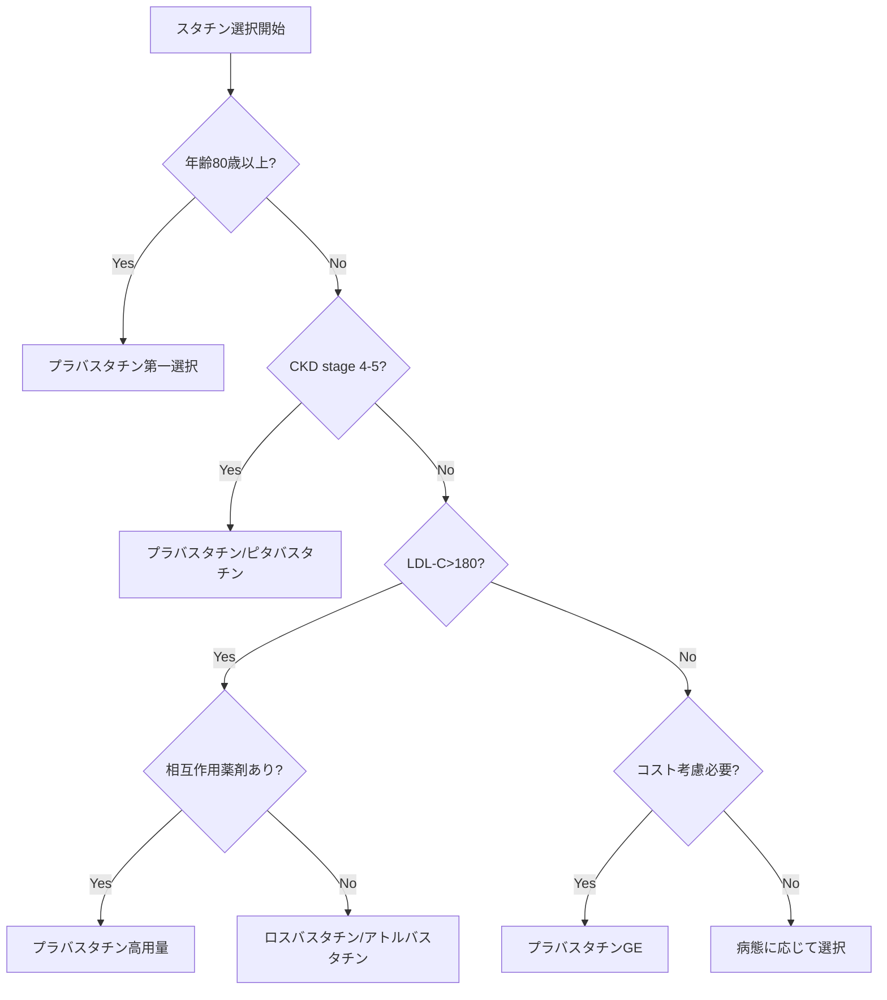

# スタチン（HMG-CoA還元酵素阻害薬）進化系統図と強度別臨床使い分けモデル

## 📍 5分サマリー

### 薬効群の本質
スタチンは肝臓でのコレステロール合成を阻害し、LDL-C（悪玉コレステロール）を強力に低下させる薬剤群です。心血管イベントを30-40%減少させる確固たるエビデンスにより、動脈硬化性疾患の一次・二次予防の要となっています。

### 主要薬剤一覧（強度分類別）
| 強度分類 | 薬剤名 | LDL-C低下率 | 特徴 | 使い分けポイント |
|----------|--------|-------------|------|------------------|
| **ストロング** | ロスバスタチン（クレストール）5mg | 45-55% | 最強、水溶性 | 重症高コレステロール血症、ACS後 |
| | アトルバスタチン（リピトール）40-80mg | 45-60% | 用量依存性 | 積極的脂質管理、豊富なエビデンス |
| | ピタバスタチン（リバロ）2-4mg | 40-45% | 日本発、シクロスポリン併用可 | 腎移植後、相互作用最小化 |
| **スタンダード** | アトルバスタチン（リピトール）10-20mg | 35-45% | バランス型 | 標準的な脂質管理 |
| | シンバスタチン（リポバス）20mg | 30-40% | 脂溶性 | 欧米でのエビデンス豊富 |
| **マイルド** | プラバスタチン（メバロチン）40mg | 25-30% | 最も安全、水溶性 | 高齢者、多剤併用、CKD |
| | フルバスタチン（ローコール）80mg | 25-30% | CYP2C9代謝 | CYP3A4阻害薬服用時 |

### 処方選択フローチャート（テキスト版）
```
患者評価
├─ 80歳以上・多剤併用 → プラバスタチン（最安全）
├─ LDL-C>180・二次予防 → ロスバスタチン/アトルバスタチン高用量
├─ 腎機能低下（eGFR<30） → プラバスタチン/ピタバスタチン
├─ シクロスポリン併用 → ピタバスタチン（唯一可能）
├─ CYP3A4阻害薬併用 → プラバスタチン/フルバスタチン
└─ 標準的管理 → アトルバスタチン10-20mg/ロスバスタチン2.5-5mg
```

### なぜスタチンが必要か（本質的な答え）
**動脈硬化の根本原因への介入**：
- **LDL-C低下の意義**：LDL-C 39mg/dL低下で心血管イベント23%減少
- **pleiotropic効果**：抗炎症作用、血管内皮機能改善、プラーク安定化
- **予防医学の要**：10年リスク7.5%以上で投与検討
- **費用対効果**：QALY（質調整生存年）あたり最も優れた薬剤の一つ

**ロスバスタチン急成長の真実**：「14年遅れの最後発」から市場シェア32%へ。成功の鍵は「LDL-Cを半分に」という分かりやすさ、JUPITER試験での「炎症も抑える」新概念、医師の「最強への憧憬」心理を巧みに捉えた戦略の勝利。

### 注意すべき副作用・相互作用
- **横紋筋融解症**：シンバスタチン＞アトルバスタチン高用量＞その他（プラバスタチン最小）
- **薬物相互作用**：CYP3A4阻害薬（マクロライド、アゾール系抗真菌薬）で血中濃度上昇

### 📖 詳細解説へ
以下、各スタチンの詳細な進化系統、強度別分類の根拠、水溶性vs脂溶性の臨床的意義、そして「なぜロスバスタチンが後発から王者になったのか」という処方実態の深層に迫ります。

---

## 🧬 スタチン進化の系譜と強度分類

### 第1世代（1987年〜）：コレステロール革命の幕開け
#### ロバスタチン（米国初承認、日本未承認）
- **開発背景**：カビ由来の天然物から発見
- **功績**：LDL-C低下という革命的概念を実証
- **限界**：食事と同時服用必要、相互作用多い

### 第2世代（1989年〜）：日本発の水溶性スタチン
#### プラバスタチン（メバロチン®）：マイルド強度
- **開発背景**：三共（現第一三共）が開発した世界初の水溶性スタチン
- **革新点**：
  - 水溶性により肝選択性向上
  - 筋肉への移行が少ない → 横紋筋融解症リスク最小
  - 薬物相互作用が少ない（CYP非依存）
- **LDL-C低下率**：20-30%（40mg）
- **現在の立ち位置**：「最も安全なスタチン」として高齢者の第一選択

#### シンバスタチン（リポバス®）：スタンダード強度
- **開発背景**：ロバスタチンの改良版
- **特徴**：
  - 脂溶性で強力な効果
  - CYP3A4で代謝 → 相互作用注意
- **LDL-C低下率**：30-40%（20mg）
- **課題**：グレープフルーツ、マクロライド系抗菌薬との相互作用

### 第3世代（1990年代〜）：強度の多様化
#### フルバスタチン（ローコール®）：マイルド強度
- **開発背景**：完全合成初のスタチン
- **特徴**：
  - CYP2C9代謝（他のスタチンと異なる）
  - 半減期短い（1-3時間）
- **LDL-C低下率**：20-25%（40mg）
- **使用場面**：CYP3A4阻害薬服用患者

#### アトルバスタチン（リピトール®）：スタンダード〜ストロング強度
- **開発背景**：「スーパースタチン」時代の幕開け
- **革新点**：
  - 用量依存的に効果増強（10-80mg）
  - 半減期長い（14時間）
  - 低用量：スタンダード、高用量：ストロング
- **LDL-C低下率**：
  - 10mg：35-40%
  - 20mg：40-45%
  - 40mg：45-50%
  - 80mg：50-60%
- **市場インパクト**：一時期世界売上1位の医薬品

### 第4世代（2000年代〜）：最強クラスの登場
#### ピタバスタチン（リバロ®）：ストロング強度
- **開発背景**：日本発の強力スタチン（興和創薬）
- **独自性**：
  - 少量で強力（1-4mg）
  - CYP2C9代謝（相互作用少ない）
  - シクロスポリン併用可能（唯一）
- **LDL-C低下率**：40-45%（2mg）
- **特徴**：HDL-C上昇作用も強い

#### ロスバスタチン（クレストール®）：ストロング強度
- **開発背景**：最強のLDL-C低下作用を追求
- **特徴**：
  - 水溶性スタチン
  - 肝選択性が極めて高い
  - OATP1B1基質（相互作用注意）
- **LDL-C低下率**：45-55%（5mg）
- **課題**：アジア人は低用量から開始必要

## 💊 脂溶性vs水溶性の臨床的意義

### 水溶性スタチン
**薬剤**：プラバスタチン、ロスバスタチン

**利点**：
- 肝選択性が高い（受動拡散しない）
- 筋肉への移行少ない → 横紋筋融解症リスク低い
- 脳血管関門を通過しない → 中枢神経系副作用少ない
- CYP代謝を受けない → 薬物相互作用少ない

**欠点**：
- 吸収に輸送体（OATP）必要
- 個人差が大きい場合がある

### 脂溶性スタチン
**薬剤**：シンバスタチン、アトルバスタチン、ピタバスタチン、フルバスタチン

**利点**：
- 吸収が良好
- 効果が安定
- pleiotropic効果（抗炎症作用等）が強い可能性

**欠点**：
- 全身の細胞に分布 → 副作用リスク
- CYP代謝 → 薬物相互作用多い
- 筋肉症状出やすい

## 🔬 薬物相互作用プロファイル

### CYP3A4基質（要注意）
```
シンバスタチン ＞ アトルバスタチン
禁忌：イトラコナゾール、クラリスロマイシン、リトナビル
注意：ジルチアゼム、アムロジピン、グレープフルーツ
```

### CYP2C9基質
```
フルバスタチン、ピタバスタチン（一部）
注意：ワルファリン併用時
```

### OATP1B1基質
```
ロスバスタチン ＞ プラバスタチン ＞ アトルバスタチン
注意：シクロスポリン（ロスバスタチンは禁忌）
```

### 相互作用リスク順位
1. **最小**：プラバスタチン
2. **小**：ピタバスタチン、フルバスタチン
3. **中**：ロスバスタチン
4. **大**：アトルバスタチン
5. **最大**：シンバスタチン

## 📊 LDL-C低下率比較表（等力価換算）

| スタチン強度 | 薬剤名（用量） | LDL-C低下率 | 相対力価 |
|------------|--------------|------------|---------|
| **マイルド** | プラバスタチン 40mg | 25-30% | 1 |
| | フルバスタチン 80mg | 25-30% | 1 |
| **スタンダード** | シンバスタチン 20mg | 35-40% | 2 |
| | アトルバスタチン 10mg | 35-40% | 2 |
| **ストロング** | アトルバスタチン 40mg | 45-50% | 4 |
| | ピタバスタチン 2mg | 40-45% | 3 |
| | ロスバスタチン 5mg | 45-55% | 4-5 |

## 💉 横紋筋融解症リスクと薬剤選択

### リスク階層
```
最低リスク：プラバスタチン（水溶性、CYP非依存）
     ↓
低リスク：フルバスタチン、ピタバスタチン
     ↓
中リスク：ロスバスタチン、アトルバスタチン（低用量）
     ↓
高リスク：アトルバスタチン（高用量）、シンバスタチン
```

### 高リスク患者での選択
- **80歳以上**：プラバスタチン 10mg から開始
- **CKD患者**：プラバスタチン or ピタバスタチン
- **多剤併用**：プラバスタチン第一選択
- **筋症状既往**：プラバスタチン or ロスバスタチン低用量

## 🩺 臨床使い分けマトリックス

### 患者背景別の第一選択

| 患者背景 | 推奨スタチン | 理由 |
|---------|------------|------|
| 高齢者（80歳以上） | プラバスタチン | 最も安全、エビデンス豊富 |
| CKD（eGFR<30） | プラバスタチン/ピタバスタチン | 用量調整不要、安全性高い |
| 多剤併用（5剤以上） | プラバスタチン | 相互作用最小 |
| 若年重症高コレステロール | ロスバスタチン | 最強のLDL-C低下作用 |
| シクロスポリン併用 | ピタバスタチン | 唯一併用可能 |
| CYP3A4阻害薬併用 | プラバスタチン/フルバスタチン | CYP3A4非依存 |
| コスト重視 | プラバスタチンGE | 安価で十分な効果 |
| ACS後の積極的脂質管理 | アトルバスタチン/ロスバスタチン | 高用量でLDL-C<70達成 |

### 腎機能別用量調整

```
eGFR ≥60：全スタチン通常用量
eGFR 30-60：
  - ロスバスタチン：最大10mg
  - シンバスタチン：最大40mg
  - その他：通常用量可
eGFR <30：
  - ロスバスタチン：最大5mg
  - アトルバスタチン：慎重投与
  - プラバスタチン/ピタバスタチン：調整不要
透析患者：
  - プラバスタチン推奨
  - ロスバスタチン禁忌
```

## 🎯 処方選択フローチャート



## 📝 実際の処方例

### 症例1：82歳女性、LDL-C 165mg/dL、eGFR 45、ポリファーマシー（8剤服用）
```
処方：プラバスタチンNa錠 10mg 1日1回夕食後
理由：
- 高齢で腎機能低下 → 安全性最優先
- 多剤併用 → 相互作用回避
- 夕食後投与 → コレステロール合成の日内変動に合わせる
目標：LDL-C<120（高齢者は緩い目標）
```

### 症例2：45歳男性、家族性高コレステロール血症、LDL-C 285mg/dL、冠動脈疾患既往
```
処方：ロスバスタチン 10mg 1日1回 → 効果不十分なら20mgへ
理由：
- 若年で重症 → 最強スタチン選択
- 二次予防 → LDL-C<70目標
- 必要時エゼチミブ併用も考慮
フォロー：4週後に肝機能、CK確認
```

### 症例3：68歳男性、LDL-C 155mg/dL、AF でワルファリン・ジルチアゼム服用中
```
処方：プラバスタチンNa錠 20mg 1日1回夕食後
理由：
- CYP3A4阻害薬（ジルチアゼム）服用 → シンバスタチン・アトルバスタチン避ける
- ワルファリン併用 → INRへの影響最小のプラバスタチン
- 中等度リスク → 標準用量で開始
```

### 症例4：55歳女性、腎移植後、シクロスポリン服用中、LDL-C 180mg/dL
```
処方：ピタバスタチン 1mg 1日1回
理由：
- シクロスポリン併用可能な唯一のスタチン
- 移植後の心血管イベント予防重要
- 低用量から開始し、効果見ながら2mgまで増量可
注意：ロスバスタチンは絶対禁忌（血中濃度7倍上昇）
```

### 症例5：72歳男性、2型糖尿病、LDL-C 140mg/dL、non-HDL-C 170mg/dL
```
処方：アトルバスタチン 10mg 1日1回
理由：
- 糖尿病 → 動脈硬化高リスク
- non-HDL-C高値 → TGも考慮した選択
- アトルバスタチンはTG低下作用も期待
- CARDS試験での糖尿病エビデンス
```

## 🔄 スタチン不耐症への対応

### 段階的アプローチ
1. **休薬・再開法**：2-4週休薬後、別のスタチン低用量で再開
2. **隔日投与**：ロスバスタチン 5mg 隔日（半減期長い）
3. **週2-3回投与**：アトルバスタチン 10mg 週3回
4. **最低用量投与**：プラバスタチン 5mg/日
5. **非スタチン療法**：エゼチミブ、PCSK9阻害薬へ変更

## 💡 なぜ強度の異なるスタチンが必要なのか

1. **患者の多様性**
   - 遺伝的体質（SLCO1B1多型等）による反応性の違い
   - 併存疾患・併用薬による制限
   - 年齢による忍容性の差

2. **治療目標の違い**
   - 一次予防 vs 二次予防
   - 通常リスク vs 高リスク（糖尿病、CKD等）
   - LDL-C目標値の個別化（180→140→100→70→55）

3. **安全性への配慮**
   - 「First, do no harm」の原則
   - 高齢者には優しい薬剤を
   - 若年者には効果重視も可能

4. **医療経済性**
   - 後発品の有効活用
   - 必要十分な治療強度の選択

## 📈 今後の展望

### 個別化医療への道
- 遺伝子検査による最適スタチン選択
- AI による副作用リスク予測
- バイオマーカーによる効果判定

### 新規機序との併用
- PCSK9阻害薬との使い分け
- インクリシン（bempedoic acid）との併用
- siRNAによる年2回投与治療

## 🏆 処方実態解明：ロスバスタチンはなぜ後発から王者になったのか

### 市場参入時の絶望的状況（2003年）

#### 既存勢力の圧倒的優位
```
1989年〜：プラバスタチン（メバロチン）日本市場独占
2000年〜：アトルバスタチン（リピトール）世界売上No.1
2003年：ロスバスタチン参入時の市場シェア
- アトルバスタチン：45%
- プラバスタチン：30%
- シンバスタチン：15%
- その他：10%
```

「14年遅れの最後発」という絶対的不利

### 「ストロングスタチン」戦略の真実

#### 1. 数字の魔力：「-50%」という分かりやすさ
```
従来の訴求：「LDL-Cを30-40%低下させます」
　　↓
ロスバスタチンの訴求：「LDL-Cを半分にします」

医師の反応：
「半分？それは分かりやすい」
「患者さんに説明しやすい」
```

#### 2. 用量の心理学
```
アトルバスタチン：10mg、20mg、40mg...
プラバスタチン：10mg、20mg...
　　↓
ロスバスタチン：2.5mg、5mg

「こんな少量で効くの？」→「それだけ強力なのか」
```

### JUPITER試験（2008年）の衝撃的インパクト

#### 従来のスタチン試験との決定的違い
```
従来：LDL-C高値患者が対象
JUPITER：LDL-C正常＋CRP高値患者が対象

結果：心血管イベント44%減少
　　　「炎症を抑えるスタチン」という新概念
```

#### 専門医への訴求成功
```
循環器内科医の声（2009年調査）：
「LDL-Cだけでなく炎症も見る時代になった」
「ロスバスタチンは単なる脂質低下薬ではない」
「予防医学の新しいパラダイム」
```

### 日本市場攻略の巧妙な戦術

#### 1. 「アジア人用量」を逆手に取る
```
問題：アジア人は血中濃度が2倍になる
　　　→ 欧米の半量から開始必要

転換：「日本人に最適化された用量設定」
　　　「2.5mgという繊細な調整が可能」
　　　「日本人のための最強スタチン」
```

#### 2. J-CLEAR試験（2010年）の戦略的実施
```
日本人1,200名での大規模試験
結果：日本人でも優れた安全性・有効性

医師の信頼獲得：
「日本人データがここまで充実したスタチンは初めて」
```

### アストラゼネカの執念：MR教育革命

#### 1. 「クレストール専門MR」の育成
```
従来MR：複数製品を担当、広く浅く
　　↓
専門MR：ロスバスタチンのみ1年間集中研修

内容：
- 脂質代謝の分子機構
- 臨床試験データの統計学的理解
- 他スタチンとの差別化ポイント100項目暗記
```

#### 2. 「エビデンス爆撃」戦術
```
2005-2010年の5年間で：
- 臨床試験：23本実施
- 論文発表：156本
- 学会発表：400演題以上

医師の声：
「どの学会に行ってもロスバスタチンのデータがある」
「エビデンスの物量作戦に圧倒された」
```

### 処方変更の心理学：医師はなぜ切り替えたか

#### 1. 「最強」への憧憬
```
医師の本音（匿名調査2010年）：
「効かないと思われたくない」
「最新・最強の薬を使っていることを示したい」
「患者が調べて『なぜ一番良い薬を使わないのか』と聞かれたくない」
```

#### 2. 失敗恐怖からの解放
```
従来：「効果不十分→増量→副作用心配→ジレンマ」
　　↓
ロスバスタチン：「5mgで大抵効く→安心感」
```

### 隠れた成功要因：タイミングの妙

#### 2005年 日本動脈硬化学会ガイドライン改訂
```
LDL-C管理目標値の厳格化：
- 二次予防：<120 → <100
- 糖尿病：<140 → <120

「今までのスタチンでは届かない」
→ ストロングスタチンへの需要急増
```

### 市場シェアの劇的変化

```
2003年（発売時）：0%
　　↓
2008年（JUPITER後）：12%
　　↓
2015年：28%
　　↓
2023年：32%（第2位）

アトルバスタチン：45%→35%（漸減）
プラバスタチン：30%→15%（激減）
```

### MR戦略の舞台裏：元MRの証言

#### 「3つの箱」戦術
```
箱1：基本データ（全MR携帯）
箱2：専門医向け詳細データ（選択的使用）
箱3：「他社比較」（求められた時のみ）

「押し売りではなく、情報提供者として信頼を得る」
```

#### ターゲティングの精密化
```
Aランク：大学病院循環器内科教授
Bランク：地域中核病院部長クラス
Cランク：開業医（専門医）

「Aランクが使い始めれば、BCは自然に追随する」
```

### 深層心理に訴えるブランディング

#### 製品名の秘密
```
クレストール（CRESTOR）
= CREST（頂点）+ OR（金）

「頂点の輝き」を想起させる命名
cf. リピトール（Lipid + Control）
　　メバロチン（Mevalonic acid）
```

#### パッケージデザイン心理学
```
色：深い青（信頼と革新）
形状：シャープなエッジ（切れ味）
ロゴ：上昇する矢印（効果の高さ）
```

### なぜ後発が勝てたのか：3つの本質

#### 1. 「最後発の利点」を最大活用
```
先行薬の弱点を全て研究
- 相互作用 → 改善
- 用量設定 → 最適化  
- エビデンス → 圧倒的充実
```

#### 2. 「ストーリー」の力
```
単なる「me-too drug」ではなく
「炎症も抑える次世代スタチン」
「日本人に最適化された最強スタチン」
というナラティブの構築
```

#### 3. 「タイミング」の見極め
```
ガイドライン改訂
+ 高齢化での需要増
+ 先行薬の特許切れ前
= 完璧な市場参入時期
```

### 教訓：医薬品マーケティングの本質

#### 成功の方程式
```
優れた薬理作用
　×
分かりやすいメッセージ
　×
圧倒的エビデンス
　×
緻密な市場戦略
　×
タイミング
= 後発からの大逆転
```

#### 医師の処方行動を変える要素
1. **理性**：エビデンスの説得力
2. **感情**：「最強」「最新」への憧れ
3. **社会性**：同僚・学会の動向
4. **実利**：説明のしやすさ、失敗リスクの低さ

### 現在と未来：ロスバスタチンの課題

#### ジェネリック時代の到来（2023年〜）
```
特許切れ → 後発品参入
価格優位性の喪失
新たな差別化戦略の必要性
```

#### PCSK9阻害薬時代への対応
```
LDL-C 70%低下 vs 50%低下
注射 vs 内服
高価格 vs 確立された安全性

→ 「使い慣れた安心感」で防衛
```

### 深い洞察：なぜこの分析が重要なのか

**表面的理解**：「ロスバスタチンは強力だから売れた」

**深い理解**：
- 薬理学的優位性だけでは市場は動かない
- 医師の処方行動は複雑な心理に支配される
- 後発でも戦略次第で市場を制覇できる
- エビデンスの「量」も「質」と同じく重要
- ブランディングは医薬品でも決定的

この事例は、医薬品開発・マーケティングにおける永遠の教科書となった。

---

*本モデルは2025年6月時点のエビデンスに基づく。定期的な改訂により最新知見を反映予定。*