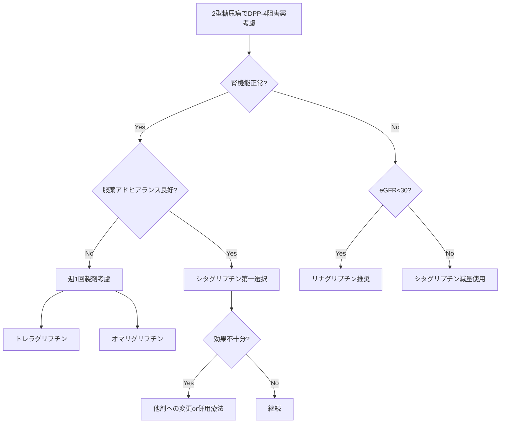

# DPP-4阻害薬進化系統図と臨床使い分けモデル

## 🧬 DPP-4阻害薬進化の系譜

### 前史：インクレチン研究の夜明け（1960-2000年）
#### インクレチン効果の発見
- **1964年**: 経口vs静注ブドウ糖負荷でインスリン分泌量の違いを発見
- **概念確立**: 腸管ホルモンが膵島機能を調節する「腸膵軸」の存在
- **意義**: 消化管が単なる吸収器官ではなく、内分泌器官であることを証明

#### GLP-1の同定と限界
- **1983年**: GLP-1の単離・同定に成功
- **問題点**: 
  - 半減期わずか1-2分（DPP-4による急速分解）
  - 静脈内持続投与は非現実的
  - ペプチドホルモンの経口投与は不可能
- **挫折**: 直接的なGLP-1療法は実用化困難

### 第1世代（2006-2009年）：パイオニアの登場

#### シタグリプチン（ジャヌビア®/グラクティブ®）2006年
- **開発背景**: メルク社が「DPP-4阻害」という逆転の発想で開発
- **革新点**:
  - 世界初の経口インクレチン関連薬
  - 低血糖リスク最小の画期的安全性
  - 1日1回投与の利便性
- **課題**: 
  - 薬価が高額（新規作用機序のため）
  - 長期安全性データ不足
  - 効果の個人差

#### ビルダグリプチン（エクア®）2010年（欧州2007年）
- **開発背景**: ノバルティス社がシタグリプチンに続いて開発
- **特徴**:
  - DPP-4との共有結合による強力阻害
  - 1日2回投与（50mg×2）
  - 日本では承認遅延（肝機能への懸念）
- **差別化**: α細胞機能への直接作用

### 第2世代（2010-2011年）：日本発と選択肢の拡大

#### アログリプチン（ネシーナ®）2010年
- **開発背景**: 武田薬品が開発した日本発DPP-4阻害薬
- **革新点**:
  - 極めて高いDPP-4選択性（>10,000倍）
  - 化学構造の独自性（他剤と異なる骨格）
  - 日本人での豊富な臨床データ
- **特徴**: 25mg 1日1回、シンプルな用量設定

#### リナグリプチン（トラゼンタ®）2011年
- **開発背景**: ベーリンガーインゲルハイムが腎機能低下患者向けに開発
- **画期的特徴**:
  - 胆汁排泄型（腎排泄わずか5%）
  - 腎機能による用量調整不要
  - 肝代謝も最小限
- **適応拡大**: 透析患者でも安全に使用可能

### 第3世代（2012-2013年）：差別化と特殊化

#### テネリグリプチン（テネリア®）2012年
- **開発背景**: 田辺三菱製薬による構造最適化
- **特徴**:
  - 独自の化学構造（チアゾリジン環）
  - 1日1回20mg（最大40mg）
  - 日本・韓国中心の展開
- **差別化**: 製造コスト低減による薬価競争力

#### アナグリプチン（スイニー®）2012年
- **開発背景**: 三和化学研究所の創薬
- **特徴**:
  - 1日2回投与（100mg×2）
  - 速やかな効果発現
  - ニッチ市場での生存戦略

#### サキサグリプチン（オングリザ®）2013年
- **開発背景**: アストラゼネカとBMSの共同開発
- **特徴**:
  - 活性代謝物も DPP-4阻害活性
  - CYP3A4/5で代謝
  - グローバル展開も日本では出遅れ

### 第4世代（2015年）：革新的投与法

#### トレラグリプチン（ザファテック®）2015年
- **開発背景**: 武田薬品が週1回製剤として開発
- **革命的特徴**:
  - 世界初の週1回投与DPP-4阻害薬
  - 100mg週1回で安定した血糖管理
  - 服薬アドヒアランスの劇的改善
- **適応**: 服薬困難患者、多剤併用患者

#### オマリグリプチン（マリゼブ®）2015年（日本2017年）
- **開発背景**: MSDが週1回製剤として開発
- **特徴**:
  - 25mg週1回投与
  - シタグリプチンの構造を基に最適化
  - 欧米では開発中止、日本のみ承認

## 💊 臨床使い分けマトリックス

### 患者背景別の第一選択

| 患者背景 | 推奨DPP-4阻害薬 | 理由 |
|---------|----------------|------|
| 標準的2型糖尿病 | シタグリプチン | 最も使用経験豊富、安全性確立 |
| 高度腎機能低下 | リナグリプチン | 用量調整不要、胆汁排泄 |
| 軽度腎機能低下 | シタグリプチン（減量） | 25-50mg、豊富なエビデンス |
| 服薬アドヒアランス不良 | トレラグリプチン | 週1回投与で管理改善 |
| 高齢者（80歳以上） | シタグリプチン/リナグリプチン | 安全性データ豊富 |
| 肝機能障害 | アログリプチン | 肝代謝への影響最小 |
| 薬価重視 | テネリグリプチン | 比較的安価 |
| 多剤併用 | リナグリプチン | 薬物相互作用最小 |

### 併用療法での選択基準

| 併用薬 | 推奨DPP-4阻害薬 | 避けるべき組み合わせ | 理由 |
|--------|----------------|-------------------|------|
| メトホルミン | すべて使用可 | 特になし | 理想的な併用、相乗効果 |
| SGLT2阻害薬 | シタグリプチン | 特になし | 豊富な併用データ |
| SU薬 | 少量から開始 | 高用量併用 | 低血糖リスク |
| チアゾリジン | すべて使用可 | 特になし | 作用機序の相補性 |
| GLP-1受容体作動薬 | 原則併用しない | すべて | 作用重複、保険適用なし |
| インスリン | すべて使用可 | 特になし | インスリン減量効果 |

## 📊 薬理学的パラメータ比較

### DPP-4阻害薬の特性一覧

| 薬剤名 | 選択性 | 半減期 | 排泄経路 | 用量調整 | 投与回数 |
|--------|--------|--------|----------|----------|----------|
| シタグリプチン | 2,659倍 | 12時間 | 腎79% | 要（腎） | 1日1回 |
| ビルダグリプチン | 32,000倍 | 2-3時間 | 腎85% | 要（腎） | 1日2回 |
| アログリプチン | >10,000倍 | 21時間 | 腎76% | 要（腎） | 1日1回 |
| リナグリプチン | 40,000倍 | 12時間 | 胆汁90% | 不要 | 1日1回 |
| テネリグリプチン | 38,000倍 | 24時間 | 腎45% | 要（腎） | 1日1回 |
| アナグリプチン | 20,000倍 | 4-6時間 | 腎49% | 要（腎） | 1日2回 |
| サキサグリプチン | 400倍 | 2.5時間 | 腎75% | 要（腎） | 1日1回 |
| トレラグリプチン | 22,000倍 | 54時間 | 腎76% | 要（腎） | 週1回 |
| オマリグリプチン | >5,000倍 | 21-66時間 | 腎74% | 要（腎） | 週1回 |

### DPP-4阻害活性の比較

```
IC50値（nM）による阻害力順位：
リナグリプチン (1.0) > アログリプチン (6.9) > 
サキサグリプチン (10) > シタグリプチン (19) > 
ビルダグリプチン (62) > テネリグリプチン (65)
```

## 🔄 処方選択フローチャート



## 🎯 各薬剤の位置づけと特徴

### 市場リーダー：シタグリプチン
- **シェア**: 約40%（DPP-4阻害薬市場）
- **強み**: 圧倒的な使用実績、豊富なエビデンス
- **処方医の評価**: 「迷ったらシタグリプチン」

### 腎機能低下のスペシャリスト：リナグリプチン
- **独自性**: 唯一の非腎排泄型
- **適応拡大**: 透析患者でも用量調整不要
- **ポジション**: 腎臓専門医の第一選択

### 日本の独自路線：アログリプチン、テネリグリプチン
- **開発**: 日本企業による創薬
- **特徴**: 日本人データの充実
- **戦略**: 国内市場に特化

### 革新的アプローチ：トレラグリプチン
- **画期性**: 週1回投与の実現
- **対象**: アドヒアランス不良患者
- **課題**: 高薬価、適応の限定

### ニッチ戦略：その他の薬剤
- **生存戦略**: 特定の患者層に特化
- **差別化**: 価格、剤形、適応症

## 🌍 国際比較：地域による使い分けの違い

### 日本
- **特徴**: DPP-4阻害薬の使用率が世界一高い（糖尿病薬の50%以上）
- **背景**: 低血糖忌避、高齢者多い、インスリン抵抗性より分泌不全
- **人気**: シタグリプチン＞リナグリプチン＞アログリプチン

### 米国
- **特徴**: GLP-1受容体作動薬優位、DPP-4は第3選択以下
- **背景**: 肥満多い、より強力な血糖降下作用を重視
- **使用**: 腎機能低下例中心

### 欧州
- **特徴**: メトホルミン絶対優位、DPP-4は併用中心
- **背景**: 医療経済性重視、安価な薬剤優先
- **特殊**: ビルダグリプチンが比較的人気

## 💡 なぜ似たDPP-4阻害薬が多数存在するのか

### 1. 特許戦略と市場参入
- **基本特許回避**: 各社が独自の化学構造を開発
- **巨大市場**: 糖尿病患者の増加で魅力的
- **開発リスク**: 比較的低い（作用機序確立）

### 2. 微細な差別化の積み重ね
- **薬物動態**: 半減期、排泄経路の違い
- **選択性**: DPP-8/9への影響の差
- **剤形**: 週1回製剤などの革新

### 3. 地域特性への対応
- **日本**: 低用量志向、安全性重視
- **欧米**: 強力な効果、利便性重視
- **新興国**: 低価格、アクセス性

### 4. 患者の多様性
- **腎機能**: 正常〜透析まで幅広い
- **年齢**: 若年〜超高齢者
- **併存疾患**: 肝障害、心疾患など

### 5. 医療経済的要因
- **競争**: 薬価引き下げ圧力
- **差別化**: 付加価値による生存
- **後発品**: 特許切れ対策

## 📈 DPP-4阻害薬の未来展望

### 次世代DPP-4阻害薬の可能性

#### 超長時間作用型
- **月1回投与**: 理論的には可能
- **課題**: 安全性、可逆性の確保
- **開発状況**: 基礎研究段階

#### 組織選択的DPP-4阻害
- **概念**: 特定臓器でのみ作用
- **利点**: 副作用リスク低減
- **標的**: 膵島、腸管、脂肪組織

#### 多機能型DPP-4阻害薬
- **DPP-4/SGLT2同時阻害**: 単剤で複数作用
- **DPP-4/GLP-1増強**: より強力な効果
- **開発**: 臨床試験段階

### 個別化医療への応用

#### バイオマーカーによる薬剤選択
- **基礎DPP-4活性**: 効果予測可能
- **GLP-1分泌能**: 反応性の指標
- **遺伝子多型**: TCF7L2など

#### AI活用による最適薬剤選択
- **機械学習**: 患者データから予測
- **リアルワールドデータ**: 実臨床での解析
- **将来**: 個別化処方支援システム

### 新たな適応症

#### 心血管保護
- **基礎研究**: 抗炎症、抗動脈硬化作用
- **臨床**: 心血管イベント抑制（中立的）
- **期待**: 特定の患者群での有効性

#### 認知症予防
- **機序**: 中枢神経系のDPP-4阻害
- **エビデンス**: 観察研究で関連示唆
- **展望**: 大規模介入試験必要

#### NASH/NAFLD
- **作用**: 肝臓の炎症・線維化抑制
- **開発**: 複数の臨床試験進行中
- **位置づけ**: 補助療法として期待

## 🏆 DPP-4阻害薬が残した功績

### 1. 糖尿病治療の安全性向上
- **低血糖回避**: 生活の質改善
- **体重中性**: 肥満恐怖からの解放
- **高齢者医療**: 安心して使える薬剤

### 2. インクレチン医学の確立
- **新領域開拓**: 腸膵軸の臨床応用
- **創薬思想**: 生理的システムの活用
- **波及効果**: GLP-1薬開発への道筋

### 3. 個別化医療の推進
- **多様な選択肢**: 患者に応じた使い分け
- **精密医療**: 腎機能別の投与設計
- **将来展望**: さらなる層別化へ

### 4. 医療経済への貢献
- **間接効果**: 合併症予防による医療費抑制
- **社会的価値**: 労働生産性の維持
- **持続可能性**: 医療システムへの貢献

---

*本モデルは2025年7月時点のエビデンスに基づく。DPP-4阻害薬は、安全性と有効性のバランスに優れた薬剤群として、糖尿病治療の中核を担い続けている。*