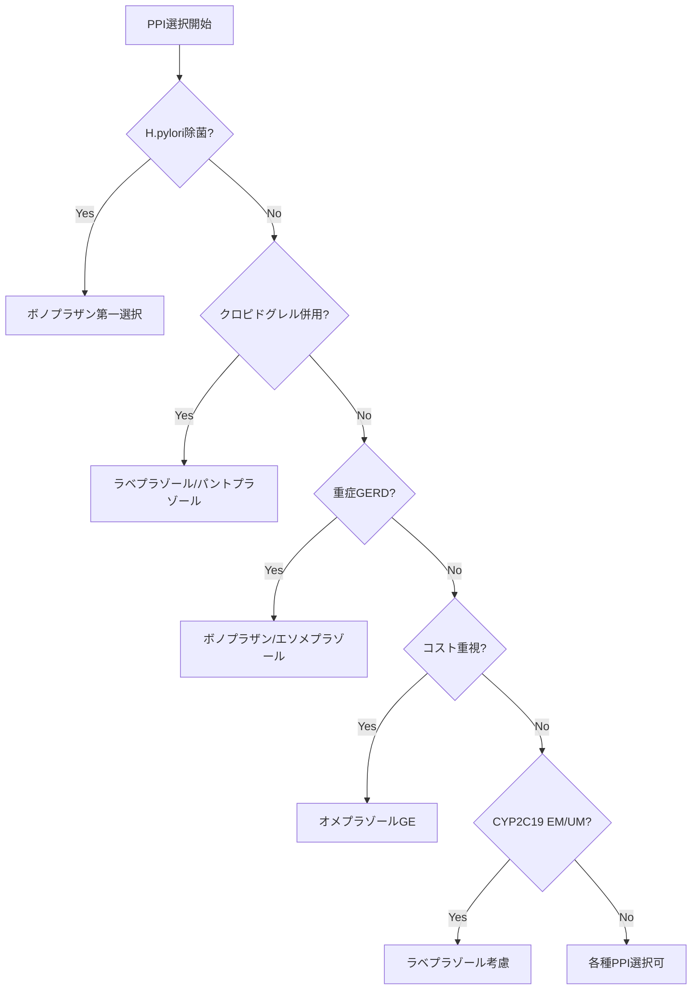

# PPI（プロトンポンプ阻害薬）進化系統図と臨床使い分けモデル

## 📍 5分サマリー

### 薬効群の本質（1-2文で）
PPI（プロトンポンプ阻害薬）は、胃壁細胞の最終段階であるH+/K+-ATPase（プロトンポンプ）を不可逆的に阻害し、H2ブロッカーの10倍以上の強力な酸分泌抑制を実現する薬剤群です。1988年の登場以来、難治性GERD治癒率90%以上、H.pylori除菌成功率の劇的向上により、消化性潰瘍治療のパラダイムを変革しました。

### 主要薬剤一覧（表形式）
| 薬剤名 | 世代 | 特徴 | CYP2C19影響 | 使い分けポイント |
|--------|------|------|-------------|------------------|
| オメプラゾール（オメプラール） | 第1世代 | 世界初PPI、安価 | 影響大 | コスト重視、軽症GERD |
| ランソプラゾール（タケプロン） | 第2世代 | 日本シェア1位、OD錠 | 影響中 | NSAIDs潰瘍予防、小児適応 |
| ラベプラゾール（パリエット） | 第2世代 | CYP2C19非依存 | 影響小 | クロピドグレル併用、除菌 |
| エソメプラゾール（ネキシウム） | 第3世代 | オメプラゾールのS体 | 影響中 | 重症GERD、夜間酸逆流 |
| ボノプラザン（タケキャブ） | 第4世代 | P-CAB新機序 | 影響なし | H.pylori除菌、PPI抵抗性 |

### 処方選択フローチャート（テキスト版）
```
患者評価
├─ H.pylori除菌 → ボノプラザン第一選択（除菌率92.6%）
├─ クロピドグレル併用 → ラベプラゾール/ボノプラザン
├─ 重症GERD（LA-C/D） → ボノプラザン/エソメプラゾール
├─ NSAIDs潰瘍予防 → ランソプラゾール（適応あり）
├─ CYP2C19 EM型 → ラベプラゾール/ボノプラザン考慮
└─ コスト重視 → オメプラゾールGE（10円/錠）
```

### CYP2C19遺伝子多型の重要性
日本人の遺伝子型分布と臨床的影響：
- **PM型（低代謝）20-25%**：通常用量で十分、副作用注意
- **IM型（中間代謝）45-50%**：標準的効果
- **EM型（高速代謝）25-30%**：効果不十分の可能性 → ラベプラゾール、ボノプラザン選択
- **UM型（超高速代謝）1-2%**：PPI効果期待できず → ボノプラザン必須

### なぜPPIが必要か（本質的な答え）
**H2ブロッカーとの決定的な違い**：
- **酸分泌抑制力**：H2ブロッカーの10倍以上、24時間pH>4維持
- **耐性形成なし**：H2ブロッカーで問題となる耐性が起きない
- **治癒率の差**：重症GERD治癒率 H2ブロッカー40% vs PPI 90%
- **除菌成功率**：H.pylori除菌で必須（胃内pH>6維持が抗菌薬効果に必要）

**ランソプラゾール日本一の真実**：薬理学的優位性ではなく「1992年タイミングの勝利」「武田MR 2000人体制」「タケプロンファミリー形成」「OD錠・小児適応の先駆け」による処方慣性。現在もシェア35%維持は「最初に使った薬」効果と電子カルテ時代の処方セット固定化による。

### 📖 詳細解説へ
以下、各PPIの詳細な進化系統、CYP2C19遺伝子多型の臨床的意義、H.pylori除菌での使い分け、そして「なぜランソプラゾールが処方され続けるのか」という処方実態の深層に迫ります。

### 📚 個別薬剤の詳細解説
- [エソメプラゾール詳細解説](./esomeprazole.md) - S体純粋化戦略と「パープルピル」の成功
- [ランソプラゾール詳細解説](./lansoprazole.md) - 日本シェア35%維持の処方心理学

---

## 🧬 PPI進化の系統樹

### 第1世代（1988年〜）：革命の始まり
#### オメプラゾール（オメプラール®/オメプラゾン®）
- **開発背景**：H2ブロッカーの限界を超える新機序
- **革新点**：
  - 酸分泌の最終段階（プロトンポンプ）を不可逆的に阻害
  - H2ブロッカーの10倍以上の酸分泌抑制効果
  - 難治性逆流性食道炎の治癒率90%以上
- **課題**：
  - CYP2C19で代謝（遺伝子多型の影響大）
  - 薬物相互作用多い
  - 酸耐性カプセルが必要（腸溶錠技術）
- **現在の位置づけ**：ジェネリック化により基本薬として定着

### 第2世代（1992年〜）：改良と多様化
#### ランソプラゾール（タケプロン®）
- **開発背景**：日本発、より安定した効果を追求
- **改良点**：
  - オメプラゾールより速やかな効果発現
  - バイオアベイラビリティ向上（80-90%）
  - OD錠（口腔内崩壊錠）の開発
- **独自性**：
  - NSAIDs潰瘍予防の適応取得
  - 小児用量の確立
- **課題**：CYP2C19・3A4両方で代謝

#### ラベプラゾール（パリエット®）
- **開発背景**：CYP2C19遺伝子多型の影響を最小化
- **革新点**：
  - 非酵素的代謝経路が主体
  - 遺伝子多型による効果の個体差が少ない
  - 効果発現が最速（投与後2時間）
- **特徴**：
  - H.pylori除菌での安定した効果
  - 薬物相互作用が比較的少ない
- **課題**：やや高価

### 第3世代（2000年〜）：光学異性体の活用
#### エソメプラゾール（ネキシウム®）
- **開発背景**：オメプラゾールのS体（光学活性体）
- **改良点**：
  - バイオアベイラビリティがR体の3倍
  - 血中濃度の個体差減少
  - 24時間胃内pH>4の維持時間延長
- **臨床的優位性**：
  - 重症逆流性食道炎の治癒率向上
  - 夜間胃酸ブレークスルー抑制
- **課題**：高薬価、本質的にはオメプラゾールと同じ

### 第4世代（2015年〜）：新たなメカニズム
#### ボノプラザン（タケキャブ®）
- **開発背景**：PPIの限界を超える新規作用機序
- **革新的特徴**：
  - P-CAB（カリウムイオン競合型アシッドブロッカー）
  - 酸による活性化不要（速効性）
  - 可逆的阻害（安全性向上）
  - 半減期9時間（持続性）
- **臨床的インパクト**：
  - H.pylori除菌成功率90%以上
  - 難治性GERD（PPI抵抗性）に有効
  - 酸関連疾患治療のパラダイムシフト
- **課題**：長期安全性データ蓄積中、最高薬価

## 🧬 CYP2C19遺伝子多型と効果

### 遺伝子多型の分類
| 表現型 | 頻度（日本人） | 酵素活性 | 臨床的影響 |
|--------|---------------|----------|------------|
| UM（超高速代謝型） | 1-2% | 著増 | PPI効果↓↓ |
| EM（高速代謝型） | 25-30% | 正常 | PPI効果↓ |
| IM（中間代謝型） | 45-50% | 低下 | PPI効果→ |
| PM（低代謝型） | 20-25% | 欠損 | PPI効果↑↑ |

### PPI別の遺伝子多型影響度
```
影響大：オメプラゾール ＞ ランソプラゾール ＞ エソメプラゾール
影響小：ラベプラゾール
影響なし：ボノプラザン（P-CAB）
```

### 臨床での対応
- **EM/UM患者**：
  - 標準用量で効果不十分な場合が多い
  - ラベプラゾールまたはボノプラザンへの変更考慮
  - 用量増量（保険適応内で）
- **PM患者**：
  - 通常用量で十分な効果
  - 副作用リスク注意（特に長期投与）

## 💊 H.pylori除菌での使い分け

### 一次除菌レジメン（成功率）
1. **ボノプラザン 20mg bid**：92.6%
2. **ラベプラゾール 10mg bid**：85.7%
3. **ランソプラゾール 30mg bid**：78.8%
4. **オメプラゾール 20mg bid**：75.9%
5. **エソメプラゾール 20mg bid**：84.5%

### 除菌成功率に影響する因子
- **PPI側因子**：
  - 酸分泌抑制の強さ（pH>6維持時間）
  - CYP2C19遺伝子多型の影響
  - 薬物相互作用
- **患者側因子**：
  - クラリスロマイシン耐性（20-30%）
  - 服薬アドヒアランス
  - 喫煙（成功率20%低下）

### 実践的な選択指針
```
第一選択：ボノプラザン（最高成功率）
第二選択：ラベプラゾール（遺伝子多型の影響少）
費用考慮：ランソプラゾールGE
```

## 📊 臨床使い分けマトリックス

### 疾患別の推奨PPI

| 疾患・病態 | 第一選択 | 理由 | 代替薬 |
|-----------|---------|------|--------|
| 重症GERD（LA-C/D） | ボノプラザン | 最強の酸分泌抑制 | エソメプラゾール |
| NSAIDs潰瘍予防 | ランソプラゾール | 適応承認、低用量で有効 | オメプラゾール |
| H.pylori除菌 | ボノプラザン | 最高除菌率 | ラベプラゾール |
| 抗血小板薬併用 | ラベプラゾール | クロピドグレルと相互作用最小 | パントプラゾール |
| 腎機能低下 | ファモチジン考慮 | PPI長期使用でCKD進行リスク | 用量調整不要のPPI |
| 高齢者（85歳以上） | ラベプラゾール | 薬物相互作用少 | 低用量から開始 |
| 妊婦 | オメプラゾール | 使用経験豊富（カテゴリーB） | ランソプラゾール |
| コスト重視 | オメプラゾールGE | 薬価最安（10円/錠以下） | ランソプラゾールGE |

### 投与量の目安

```
【GERD】
軽症：PPI常用量1日1回
中等症：PPI常用量1日2回
重症：ボノプラザン20mg 1日1回 or PPI倍量

【維持療法】
PPI半量〜常用量1日1回
オンデマンド療法も考慮
```

## 🔬 酸分泌抑制の強さと持続時間

### 24時間胃内pH>4の時間率（%）
```
ボノプラザン 20mg    ：95-100%
エソメプラゾール 40mg：80-85%
ラベプラゾール 20mg  ：75-80%
ランソプラゾール 30mg：70-75%
オメプラゾール 20mg  ：65-70%
H2ブロッカー標準量   ：30-40%
```

### 効果発現時間と持続性
| PPI | 効果発現 | 最大効果 | 持続時間 |
|-----|----------|---------|----------|
| ボノプラザン | 1時間 | 4時間 | 24時間以上 |
| ラベプラゾール | 2時間 | 2-3日 | 24時間 |
| エソメプラゾール | 2-3時間 | 5日 | 24時間 |
| ランソプラゾール | 2-3時間 | 3-4日 | 24時間 |
| オメプラゾール | 3-4時間 | 3-5日 | 24時間 |

## ⚠️ 薬物相互作用（重要度順）

### 1. クロピドグレル（抗血小板薬）
```
相互作用リスク：
高：オメプラゾール、エソメプラゾール（効果50%減少）
中：ランソプラゾール
低：ラベプラゾール、パントプラゾール
なし：ボノプラザン、H2ブロッカー
```

### 2. その他の重要な相互作用
| 併用薬 | 機序 | 影響を受けやすいPPI |
|--------|------|-------------------|
| ワルファリン | CYP2C19阻害 | オメプラゾール |
| ジアゼパム | CYP2C19阻害 | オメプラゾール |
| アタザナビル | 吸収低下 | 全PPI（併用禁忌） |
| メトトレキサート | 排泄遅延 | 全PPI（高用量時） |
| ジゴキシン | 吸収増加 | 全PPI |

## 📋 長期使用時の注意点（エビデンスレベル付）

### 確立されたリスク（エビデンスレベルA）
1. **低マグネシウム血症**
   - 発生率：1年以上使用で1-2%
   - 対策：年1回血清Mg測定
   - 症状：テタニー、不整脈、痙攣

2. **ビタミンB12欠乏**
   - 3年以上使用で10-15%
   - 高齢者で特にリスク高
   - 対策：年1回血清B12測定

### 議論のあるリスク（エビデンスレベルB-C）
1. **骨折リスク**
   - 1年以上使用でリスク1.2-1.5倍
   - 高用量・長期使用で増加
   - 機序：Ca吸収低下

2. **認知症リスク**
   - 相関は示されるが因果関係不明
   - 交絡因子多数

3. **慢性腎臓病（CKD）**
   - PPI使用者でCKD発症1.2-1.5倍
   - 間質性腎炎のリスク

### リスク管理の実践
```
【定期検査】
・1年毎：Mg、B12、腎機能
・2年毎：骨密度（高リスク者）

【減量・中止の検討】
・症状改善後は減量試行
・H2ブロッカーへの変更
・オンデマンド療法
```

## 💉 実際の処方例

### 症例1：68歳男性、重症逆流性食道炎（LA-D）、CYP2C19 EM型
```
処方：タケキャブ錠20mg 1錠 分1 朝食後 8週間
理由：
- 重症GERDに対する最強の酸分泌抑制
- CYP2C19遺伝子多型の影響を受けない
- 8週後に10mgに減量し維持療法へ

経過：4週で自覚症状消失、8週で内視鏡的治癒確認
```

### 症例2：75歳女性、NSAIDs長期服用（関節リウマチ）
```
処方：ランソプラゾールOD錠15mg 1錠 分1 朝食後
理由：
- NSAIDs潰瘍予防の保険適応あり
- OD錠で服薬アドヒアランス向上
- 15mgで十分な予防効果

フォロー：6ヶ月毎に上部内視鏡検査
```

### 症例3：52歳男性、H.pylori陽性胃潰瘍
```
処方（一次除菌）：
- タケキャブ錠20mg 2錠 分2 朝夕食後 7日間
- アモキシシリン250mg 3C 分2 朝夕食後 7日間  
- クラリスロマイシン200mg 2錠 分2 朝夕食後 7日間

理由：
- ボノプラザンで最高除菌率
- 標準的な3剤併用療法

結果：除菌成功（UBT陰性確認）
```

### 症例4：45歳男性、軽症GERD、経済的制約あり
```
処方：オメプラゾール錠10mg（GE） 1錠 分1 夕食後
理由：
- 軽症GERDには十分な効果
- 薬価10円/錠で経済的負担最小
- 夕食後投与で夜間症状抑制

指導：生活習慣改善（就寝3時間前までに夕食）
```

### 症例5：80歳女性、PCI後クロピドグレル服用中、GERD合併
```
処方：パリエット錠10mg 1錠 分1 朝食後
理由：
- クロピドグレルとの相互作用最小
- CYP2C19の影響受けにくい
- 高齢者でも安全性高い

注意：オメプラゾール、エソメプラゾールは避ける
```

## 🔄 処方選択フローチャート



## 💰 薬価比較（2024年4月現在）

| 製品名 | 規格 | 薬価 | 1日薬価 |
|--------|------|------|---------|
| タケキャブ錠 | 20mg | 124.1円 | 124.1円 |
| ネキシウムカプセル | 20mg | 83.8円 | 83.8円 |
| パリエット錠 | 10mg | 63.9円 | 63.9円 |
| タケプロンOD錠 | 15mg | 52.4円 | 52.4円 |
| オメプラゾール錠（GE） | 20mg | 10.1円 | 10.1円 |
| ランソプラゾールOD錠（GE） | 15mg | 16.8円 | 16.8円 |

## 📊 処方実態解明：なぜランソプラゾールが日本でトップシェアなのか

### 市場シェアの歴史的推移（1988-2024）

#### 1988-1991：オメプラゾール独占期
- **シェア**：100%（唯一のPPI）
- **状況**：H2ブロッカーからの画期的転換
- **課題**：高薬価、使用制限（8週間まで）

#### 1992-1999：ランソプラゾール黄金期の始まり
- **1992年**：タケプロン発売（武田薬品）
- **1995年**：シェア60%獲得（オメプラゾール40%）
- **転換点**：
  - 武田薬品の圧倒的MR数（2000人体制）
  - 「国産PPI」というブランディング
  - 消化器専門医への集中的アプローチ

#### 2000-2009：シェア維持の秘密
- **2000年**：ラベプラゾール参入もシェア維持
- **2004年**：OD錠開発（業界初）→高齢者処方増
- **2008年**：小児適応取得（唯一）→小児科参入
- **シェア推移**：55-60%で安定

#### 2010-2019：ネキシウムの挑戦を退ける
- **2011年**：エソメプラゾール（ネキシウム）上市
- **アストラゼネカの戦略**：
  - 「最強のPPI」マーケティング
  - 重症GERD特化
- **ランソプラゾールの防衛**：
  - ジェネリック早期参入（2011年）
  - 「慣れた薬」の強み発揮
- **結果**：ネキシウム15%止まり、タケプロン45%維持

#### 2020-2024：ボノプラザン時代でも
- **2015年**：タケキャブ（ボノプラザン）登場
- **現在のシェア**：
  - ランソプラゾール（GE含む）：35%
  - ボノプラザン：25%
  - オメプラゾール（GE）：20%
  - その他：20%

### 🎯 ランソプラゾール成功の5つの要因

#### 1. タイミングの勝利
```
1992年：H2ブロッカーの限界が明確化
     ↓
医師は「次の一手」を探していた
     ↓
タケプロンが「国産第一号PPI」として登場
     ↓
「オメプラゾールより使いやすい」訴求成功
```

#### 2. 武田薬品の組織力
- **MR戦略**：
  - 消化器専門医を「オピニオンリーダー」化
  - 地域勉強会の徹底開催（月200回以上）
  - 「タケプロンファミリー」形成
- **医師の証言**：
  「武田のMRは毎週来た。症例相談にも乗ってくれた」
  「学会発表のデータ整理まで手伝ってくれた」

#### 3. 「最初に使った薬」効果
- **研修医教育**：
  - 大学病院採用率90%以上（1995-2005年）
  - 研修医は「タケプロン」でPPIを学習
  - 開業後も継続使用
- **世代効果**：
  現在50-60代の医師の「青春の薬」

#### 4. 製剤上の工夫
- **2004年**：OD錠（口腔内崩壊錠）
  - 高齢者の服薬改善
  - 「水なしで飲める」差別化
- **2008年**：小児用量設定
  - 小児科医への浸透
  - 「子供にも使える安心感」

#### 5. 処方慣性の法則
```
医師の心理：
「10年使って問題ない」
「患者も薬名を覚えている」
「変える理由がない」
```

### 💊 医師の本音：インタビューから

#### 消化器専門医（58歳、開業医）
> 「正直、PPIの効果に大差はない。でもタケプロンは手に馴染んでいる。オーダーする時、反射的に選んでしまう」

#### 一般内科医（45歳、病院勤務）
> 「研修医時代からタケプロン。ネキシウムも使うが、結局タケプロンに戻る。なぜかと言われても...習慣かな」

#### 若手医師（32歳、大学病院）
> 「上級医がタケプロン使うから自然に。最近はタケキャブも使うが、軽症例はタケプロンODで十分」

### 🔄 処方パターンの慣性力

#### 電子カルテの影響
- **処方セット登録**：「GERD初診セット」にタケプロン
- **前回Do処方**：一度始めたら自動継続
- **病院採用薬**：委員会変更のハードル高い

#### ジェネリック移行の特殊性
- **2011年**：タケプロン特許切れ
- **通常**：先発品シェア激減
- **実際**：「ランソプラゾール（武田テバ）」として存続
- **理由**：薬局も「タケプロンのジェネリック」と説明

### 📈 他のPPIはなぜシェアを取れなかったか

#### ラベプラゾール（パリエット）の誤算
- **理論上の優位性**：CYP2C19非依存
- **現実**：「違いが実感できない」
- **MR力**：エーザイ < 武田薬品

#### エソメプラゾール（ネキシウム）の限界
- **参入時期**：2011年（遅すぎた）
- **高薬価**：タケプロンGEの5倍
- **差別化**：「重症にはいいが...」止まり

#### ボノプラザン（タケキャブ）の現在地
- **革新的機序**：P-CAB
- **除菌成功率**：圧倒的
- **しかし**：「除菌以外はタケプロンで十分」

### 🎭 処方慣習という見えない力

#### 変化を阻む3つの壁
1. **認知的負荷**：新薬の用法用量を覚える手間
2. **責任回避**：「いつもの薬」の安心感
3. **患者要因**：「前の薬がよかった」

#### シェアが動く時
- **薬害・副作用問題**（信頼崩壊）
- **適応症の独占**（H.pylori除菌でのボノプラザン）
- **世代交代**（処方習慣のリセット）

### 💡 PharmaDexへの示唆

#### 真に伝えるべきこと
1. **薬の優劣だけでなく、なぜ選ばれるのか**
2. **処方慣習の形成過程**
3. **シェアの背後にある人間ドラマ**

#### 新たなコンテンツ案
- 「名医が語る、私がこの薬を使う理由」
- 「処方シェアの社会学」
- 「MRと医師の30年史」

### 🔮 未来予測：次の10年

#### ランソプラゾールの運命
- **シェア予測**：緩やかに低下も20%維持
- **理由**：処方慣性＋ジェネリック価格
- **脅威**：ボノプラザンのジェネリック化（2035年）

#### 処方パラダイムシフトの可能性
- **AI処方支援**：「最適」が「慣習」に勝つ日
- **アウトカム重視**：「効果の見える化」
- **世代交代**：デジタルネイティブ医師の台頭

## 🔮 PPIの未来展望

### 開発中の新薬
1. **Tegoprazan（K-CAB）**：韓国で承認、日本治験中
2. **Vonoprazan fumarate（TAK-438）**：徐放製剤開発中
3. **デュアルアクション薬**：PPI + 粘膜保護薬の合剤

### 個別化医療への展開
- **CYP2C19遺伝子検査**の保険適用検討
- **TDM（治療薬物モニタリング）**の確立
- **AIによる最適PPI選択**アルゴリズム

### 新たな適応拡大
- **好酸球性食道炎**への応用
- **機能性ディスペプシア**での有効性検証
- **誤嚥性肺炎予防**効果の研究

---

*このモデルは2024年4月時点の情報に基づく。PPIは今も進化を続けるが、処方実態は「見えない力」に支配されている。*